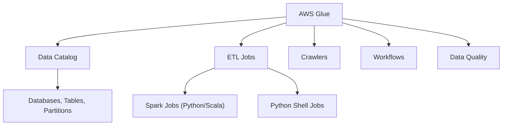

# ⚙️ AWS Glue - Ayuda Memoria para Ingenieros de Datos

## 1. 🧠 Componentes de Glue



| Componente | Descripción |
| :--- | :--- |
| **Data Catalog** | Metastore centralizado (compatible con Hive) |
| **Crawler** | Descubre schema automáticamente desde S3, JDBC, etc. |
| **ETL Job** | Trabajo de transformación (Spark o Python Shell) |
| **Trigger** | Programa ejecuciones (cron, evento, on-demand) |
| **Workflow** | Orquesta múltiples crawlers y jobs |
| **Connection** | Configuración de conexión a fuentes (JDBC, Kafka, etc.) |
| **Data Quality** | Validaciones automáticas de calidad |

---

## 2. 🕷️ Crawlers

```bash
# Crear crawler
aws glue create-crawler \
  --name "crawler-transacciones" \
  --role "arn:aws:iam::123:role/GlueRole" \
  --database-name "banco_raw" \
  --targets '{"S3Targets": [{"Path": "s3://banco-datalake/raw/transacciones/"}]}' \
  --table-prefix "raw_" \
  --schema-change-policy '{"UpdateBehavior": "UPDATE_IN_DATABASE", "DeleteBehavior": "LOG"}'

# Ejecutar crawler
aws glue start-crawler --name "crawler-transacciones"

# Ver estado
aws glue get-crawler --name "crawler-transacciones" --query 'Crawler.State'
```

---

## 3. 🐍 ETL Jobs (PySpark)

### Script Básico
```python
import sys
from awsglue.transforms import *
from awsglue.utils import getResolvedOptions
from pyspark.context import SparkContext
from awsglue.context import GlueContext
from awsglue.job import Job
from awsglue.dynamicframe import DynamicFrame
from pyspark.sql import functions as F

# Inicialización
args = getResolvedOptions(sys.argv, ['JOB_NAME', 'fecha', 'ambiente'])
sc = SparkContext()
glueContext = GlueContext(sc)
spark = glueContext.spark_session
job = Job(glueContext)
job.init(args['JOB_NAME'], args)

fecha = args['fecha']
ambiente = args['ambiente']

# === EXTRACT ===
# Leer desde Glue Catalog
df_transacciones = glueContext.create_dynamic_frame.from_catalog(
    database="banco_raw",
    table_name="raw_transacciones",
    push_down_predicate=f"year=2026 AND month=02",
).toDF()

# Leer desde S3 directo
df_clientes = spark.read.parquet(f"s3://banco-datalake/curated/clientes/")

# Leer desde JDBC (RDS/Aurora)
df_cuentas = glueContext.create_dynamic_frame.from_catalog(
    database="banco_operacional",
    table_name="cuentas",
    additional_options={"hashexpression": "id", "hashpartitions": "10"}
).toDF()

# === TRANSFORM ===
df_limpio = df_transacciones \
    .dropDuplicates(["txn_id"]) \
    .filter(F.col("monto").isNotNull()) \
    .filter(F.col("monto") > 0) \
    .withColumn("fecha", F.to_date("fecha_str", "yyyy-MM-dd")) \
    .withColumn("monto", F.col("monto").cast("decimal(15,2)")) \
    .withColumn("_procesado", F.current_timestamp())

# JOIN con dimensiones
df_enriquecido = df_limpio \
    .join(df_clientes, "cliente_id", "left") \
    .join(df_cuentas, "cuenta_id", "left")

# === LOAD ===
# Escribir a S3 particionado
df_enriquecido.write \
    .mode("overwrite") \
    .partitionBy("year", "month") \
    .parquet(f"s3://banco-datalake/curated/transacciones_enriquecidas/")

# Escribir a Redshift
glueContext.write_dynamic_frame.from_jdbc_conf(
    frame=DynamicFrame.fromDF(df_enriquecido, glueContext, "output"),
    catalog_connection="redshift-connection",
    connection_options={
        "dbtable": "analytics.fact_transacciones",
        "database": "warehouse",
        "preactions": "TRUNCATE TABLE analytics.fact_transacciones",
    },
    redshift_tmp_dir="s3://banco-datalake/tmp/redshift/"
)

job.commit()
```

### CLI para Jobs
```bash
# Crear job
aws glue create-job \
  --name "etl-transacciones" \
  --role "arn:aws:iam::123:role/GlueRole" \
  --command '{"Name": "glueetl", "ScriptLocation": "s3://scripts/etl/transacciones.py", "PythonVersion": "3"}' \
  --default-arguments '{
    "--job-language": "python",
    "--TempDir": "s3://banco-datalake/tmp/",
    "--enable-metrics": "true",
    "--enable-spark-ui": "true",
    "--enable-continuous-cloudwatch-log": "true",
    "--additional-python-modules": "great-expectations==0.18.0"
  }' \
  --worker-type "G.1X" \
  --number-of-workers 10 \
  --glue-version "4.0" \
  --timeout 120 \
  --max-retries 2

# Ejecutar job
aws glue start-job-run \
  --job-name "etl-transacciones" \
  --arguments '{"--fecha": "2026-02-12", "--ambiente": "prod"}'

# Ver estado
aws glue get-job-runs --job-name "etl-transacciones" --max-items 5

# Ver logs
aws logs get-log-events \
  --log-group-name "/aws-glue/jobs/output" \
  --log-stream-name "jr_xxxxx"
```

---

## 4. 📊 Glue Data Quality

```python
# Reglas de calidad integradas en Glue
from awsglue.transforms import EvaluateDataQuality

resultados = EvaluateDataQuality.apply(
    frame=dynamic_frame,
    ruleset="""
        Rules = [
            ColumnExists "txn_id",
            IsComplete "txn_id",
            IsUnique "txn_id",
            IsComplete "monto",
            ColumnValues "monto" > 0,
            ColumnValues "fecha" matches "\\d{4}-\\d{2}-\\d{2}",
            RowCount > 1000,
            Completeness "email" >= 0.95
        ]
    """,
    publishing_options={
        "dataQualityEvaluationContext": "transacciones_check",
        "enableDataQualityCloudWatchMetrics": True
    }
)
```

---

## 5. 🔄 Workflows (Orquestación)

```bash
# Crear workflow
aws glue create-workflow --name "pipeline-bancario-diario"

# Crear trigger programado
aws glue create-trigger \
  --name "trigger-diario-6am" \
  --workflow-name "pipeline-bancario-diario" \
  --type SCHEDULED \
  --schedule "cron(0 6 * * ? *)" \
  --actions '[{"JobName": "etl-transacciones"}]'

# Crear trigger condicional (cuando job anterior termina)
aws glue create-trigger \
  --name "trigger-post-etl" \
  --workflow-name "pipeline-bancario-diario" \
  --type CONDITIONAL \
  --predicate '{"Conditions": [{"LogicalOperator": "EQUALS", "JobName": "etl-transacciones", "State": "SUCCEEDED"}]}' \
  --actions '[{"JobName": "calidad-transacciones"}, {"CrawlerName": "crawler-curated"}]'
```

---

## 6. 💰 Optimización de Costos

| Estrategia | Ahorro |
| :--- | :--- |
| **Flex execution** | Hasta 35% (no garantiza inicio inmediato) |
| **Bookmarks** | Procesar solo datos nuevos (incremental) |
| **Push-down predicate** | Leer solo particiones necesarias |
| **Worker type G.1X vs G.2X** | G.1X más barato para mayoría de jobs |
| **Auto-scaling** | Solo escalar cuando necesario |

```python
# Habilitar Bookmarks (incremental processing)
job.init(args['JOB_NAME'], args)
# Glue rastrea qué datos ya procesó y solo lee los nuevos
```

---

## 🧭 Navegación

Vuelve al [[Índice AWS|Índice AWS]]
Relacionado: [[AWS S3 y Data Lake|S3]] | [[AWS Redshift|Redshift]] | [[AWS Kinesis|Kinesis]]
