# 🔐 AWS IAM y Seguridad Bancaria - Ayuda Memoria

## 1. 🧠 Modelo de Seguridad AWS

```mermaid
graph TD
    A["IAM"] --> B["Users"]
    A --> C["Groups"]
    A --> D["Roles"]
    A --> E["Policies"]
    D --> F["Lambda assume role"]
    D --> G["Glue assume role"]
    D --> H["EC2 assume role"]
    
    I["Seguridad Datos"] --> J["KMS (Encriptación)"]
    I --> K["Secrets Manager"]
    I --> L["CloudTrail (Auditoría)"]
    I --> M["GuardDuty (Amenazas)"]
    I --> N["Lake Formation (Acceso datos)"]
```



---

## 2. 📋 IAM Policies

### Principio del Menor Privilegio
```json
{
    "Version": "2012-10-17",
    "Statement": [
        {
            "Sid": "GlueETLPermissions",
            "Effect": "Allow",
            "Action": [
                "s3:GetObject",
                "s3:PutObject",
                "s3:ListBucket"
            ],
            "Resource": [
                "arn:aws:s3:::banco-datalake",
                "arn:aws:s3:::banco-datalake/raw/*",
                "arn:aws:s3:::banco-datalake/curated/*"
            ]
        },
        {
            "Sid": "DenegarDatosProductivos",
            "Effect": "Deny",
            "Action": "s3:*",
            "Resource": "arn:aws:s3:::banco-produccion/*",
            "Condition": {
                "StringNotEquals": {
                    "aws:PrincipalTag/Environment": "production"
                }
            }
        }
    ]
}
```

### Role para Glue Jobs
```json
{
    "Version": "2012-10-17",
    "Statement": [
        {
            "Effect": "Allow",
            "Action": [
                "s3:GetObject",
                "s3:PutObject",
                "s3:DeleteObject",
                "s3:ListBucket"
            ],
            "Resource": [
                "arn:aws:s3:::banco-datalake/*"
            ]
        },
        {
            "Effect": "Allow",
            "Action": [
                "glue:GetDatabase",
                "glue:GetTable",
                "glue:GetPartitions",
                "glue:BatchCreatePartition",
                "glue:UpdateTable"
            ],
            "Resource": "*"
        },
        {
            "Effect": "Allow",
            "Action": [
                "logs:CreateLogGroup",
                "logs:CreateLogStream",
                "logs:PutLogEvents"
            ],
            "Resource": "arn:aws:logs:*:*:/aws-glue/*"
        },
        {
            "Effect": "Allow",
            "Action": [
                "kms:Decrypt",
                "kms:GenerateDataKey"
            ],
            "Resource": "arn:aws:kms:us-east-1:123:key/clave-datos"
        }
    ]
}
```

### Trust Policy (quién puede asumir el role)
```json
{
    "Version": "2012-10-17",
    "Statement": [
        {
            "Effect": "Allow",
            "Principal": {
                "Service": "glue.amazonaws.com"
            },
            "Action": "sts:AssumeRole"
        }
    ]
}
```

---

## 3. 🔑 KMS (Encriptación)

```bash
# Crear clave KMS
aws kms create-key \
  --description "Clave para datos bancarios" \
  --key-usage ENCRYPT_DECRYPT \
  --tags '[{"TagKey": "Team", "TagValue": "DataEngineering"}]'

# Crear alias
aws kms create-alias \
  --alias-name "alias/datos-bancarios" \
  --target-key-id "arn:aws:kms:us-east-1:123:key/abcd-1234"

# Encriptar dato
aws kms encrypt \
  --key-id "alias/datos-bancarios" \
  --plaintext "dato-sensible" \
  --query CiphertextBlob --output text

# Rotar clave automáticamente
aws kms enable-key-rotation --key-id "abcd-1234"
```

```python
# Encriptar/desencriptar con boto3
import boto3
import base64

kms = boto3.client('kms')

# Encriptar
response = kms.encrypt(
    KeyId='alias/datos-bancarios',
    Plaintext=b'numero-tarjeta-1234'
)
cifrado = response['CiphertextBlob']

# Desencriptar
response = kms.decrypt(CiphertextBlob=cifrado)
original = response['Plaintext'].decode()
```

---

## 4. 🗝️ Secrets Manager

```python
import boto3
import json

secrets = boto3.client('secretsmanager')

# Obtener credenciales de base de datos
def get_db_credentials(secret_name):
    response = secrets.get_secret_value(SecretId=secret_name)
    return json.loads(response['SecretString'])

# Uso
creds = get_db_credentials('prod/banco/redshift')
# creds = {"host": "...", "port": 5439, "username": "...", "password": "..."}
```

```bash
# Crear secreto
aws secretsmanager create-secret \
  --name "prod/banco/redshift" \
  --secret-string '{"host":"cluster.us-east-1.redshift.amazonaws.com","port":5439,"username":"admin","password":"S3cur3P@ss"}'

# Rotación automática
aws secretsmanager rotate-secret \
  --secret-id "prod/banco/redshift" \
  --rotation-lambda-arn "arn:aws:lambda:us-east-1:123:function:rotar-secretos" \
  --rotation-rules '{"AutomaticallyAfterDays": 30}'
```

> [!CAUTION] Regla Bancaria
> **NUNCA** hardcodear credenciales. Siempre usar Secrets Manager o Parameter Store. Las auditorías de compliance lo verifican.

---

## 5. 📋 CloudTrail (Auditoría)

```bash
# Ver eventos recientes
aws cloudtrail lookup-events \
  --lookup-attributes AttributeKey=EventName,AttributeValue=DeleteObject \
  --start-time "2026-02-12T00:00:00Z" \
  --max-items 20

# Crear trail para auditoría completa
aws cloudtrail create-trail \
  --name "audit-trail-banco" \
  --s3-bucket-name "banco-audit-logs" \
  --is-multi-region-trail \
  --enable-log-file-validation \
  --kms-key-id "arn:aws:kms:us-east-1:123:key/audit-key"
```

### Athena para analizar logs de auditoría
```sql
-- Crear tabla sobre CloudTrail logs
CREATE EXTERNAL TABLE cloudtrail_logs (
    eventTime STRING,
    userIdentity STRUCT<type:STRING, principalId:STRING, arn:STRING, accountId:STRING, userName:STRING>,
    eventName STRING,
    sourceIPAddress STRING,
    requestParameters STRING,
    responseElements STRING
)
ROW FORMAT SERDE 'org.apache.hive.hcatalog.data.JsonSerDe'
LOCATION 's3://banco-audit-logs/AWSLogs/123/CloudTrail/';

-- ¿Quién accedió a datos sensibles?
SELECT eventTime, userIdentity.userName, eventName, sourceIPAddress
FROM cloudtrail_logs
WHERE eventName IN ('GetObject', 'PutObject')
  AND requestParameters LIKE '%clientes%'
  AND eventTime > '2026-02-01'
ORDER BY eventTime DESC;

-- ¿Accesos fuera de horario?
SELECT eventTime, userIdentity.userName, eventName
FROM cloudtrail_logs
WHERE CAST(SUBSTR(eventTime, 12, 2) AS INT) NOT BETWEEN 8 AND 18
  AND eventName NOT LIKE 'Describe%'
ORDER BY eventTime DESC LIMIT 50;
```

---

## 6. 🏦 Checklist de Compliance Bancario

### SOC 2 / ISO 27001 / PCI DSS
- [x] Encriptación en reposo (KMS) para todos los buckets
- [x] Encriptación en tránsito (TLS obligatorio)
- [x] CloudTrail habilitado en todas las regiones
- [x] MFA obligatorio para usuarios IAM
- [x] Rotación de credenciales cada 90 días
- [x] No hay access keys para root account
- [x] VPC endpoints para S3 y Glue (tráfico privado)
- [x] Bucket policies bloquean acceso público
- [x] Logging de acceso a S3 habilitado
- [x] GuardDuty habilitado para detección de amenazas

### CLI de Verificación Rápida
```bash
# Verificar buckets públicos
aws s3api list-buckets --query 'Buckets[].Name' | \
  xargs -I {} aws s3api get-public-access-block --bucket {}

# Verificar encriptación
aws s3api get-bucket-encryption --bucket banco-datalake

# Usuarios sin MFA
aws iam generate-credential-report
aws iam get-credential-report --output text --query Content | base64 -d | \
  awk -F, '$4=="true" && $8=="false" {print $1, "NO MFA"}'

# Access keys viejas (> 90 días)
aws iam generate-credential-report
aws iam get-credential-report --output text --query Content | base64 -d | \
  awk -F, '$9=="true" {print $1, $10}'
```

---

## 7. 🌐 VPC y Networking para Data


```bash
# Crear VPC Endpoint para S3 (tráfico privado, sin pasar por Internet)
aws ec2 create-vpc-endpoint \
  --vpc-id vpc-abc123 \
  --service-name com.amazonaws.us-east-1.s3 \
  --route-table-ids rtb-abc123

# VPC Endpoint para Glue
aws ec2 create-vpc-endpoint \
  --vpc-id vpc-abc123 \
  --service-name com.amazonaws.us-east-1.glue \
  --vpc-endpoint-type Interface \
  --subnet-ids subnet-abc123 \
  --security-group-ids sg-abc123
```

---

## 🧭 Navegación

Vuelve al [[Índice AWS|Índice AWS]]
Relacionado: [[AWS S3 y Data Lake|S3]] | [[AWS Redshift|Redshift]] | [[Data Governance|Governance General]]
