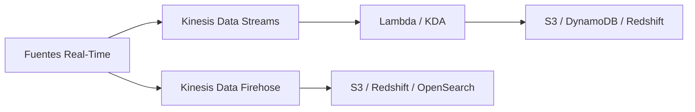

# 📨 AWS Kinesis - Ayuda Memoria para Ingenieros de Datos

## 1. 🧠 Familia Kinesis



| Servicio | Descripción | Latencia | Uso |
| :--- | :--- | :--- | :--- |
| **Data Streams** | Streaming custom, control total | ~200ms | Procesamiento complejo en tiempo real |
| **Data Firehose** | Entrega directa a destinos (sin código) | 60s+ buffer | Cargar streams a S3/Redshift fácilmente |
| **Data Analytics** | SQL sobre streams en tiempo real | ~1s | Análisis real-time sin infra |

---

## 2. 📨 Kinesis Data Streams

### CLI
```bash
# Crear stream
aws kinesis create-stream \
  --stream-name "transacciones-realtime" \
  --shard-count 4

# Ver estado
aws kinesis describe-stream-summary --stream-name "transacciones-realtime"

# Enviar registro
aws kinesis put-record \
  --stream-name "transacciones-realtime" \
  --partition-key "cliente-12345" \
  --data $(echo '{"txn":"TXN001","monto":5000}' | base64)
```

### Python SDK (Producer)
```python
import boto3
import json
from datetime import datetime

kinesis = boto3.client('kinesis')

def enviar_transaccion(transaccion):
    response = kinesis.put_record(
        StreamName='transacciones-realtime',
        Data=json.dumps(transaccion),
        PartitionKey=str(transaccion['cliente_id'])  # Mismos clientes → mismo shard
    )
    return response['SequenceNumber']

# Enviar batch de transacciones
def enviar_batch(transacciones):
    records = [
        {
            'Data': json.dumps(txn),
            'PartitionKey': str(txn['cliente_id'])
        }
        for txn in transacciones
    ]
    # Máximo 500 records o 5MB por batch
    response = kinesis.put_records(
        StreamName='transacciones-realtime',
        Records=records
    )
    fallidos = response['FailedRecordCount']
    if fallidos > 0:
        print(f"⚠️ {fallidos} registros fallaron, reintentar")
    return response
```

### Python SDK (Consumer)
```python
import boto3
import json
import time

kinesis = boto3.client('kinesis')

def consumir_stream(stream_name):
    # Obtener shards
    response = kinesis.describe_stream(StreamName=stream_name)
    shards = response['StreamDescription']['Shards']
    
    for shard in shards:
        shard_iterator = kinesis.get_shard_iterator(
            StreamName=stream_name,
            ShardId=shard['ShardId'],
            ShardIteratorType='LATEST'  # TRIM_HORIZON = desde el inicio
        )['ShardIterator']
        
        while True:
            response = kinesis.get_records(
                ShardIterator=shard_iterator,
                Limit=100
            )
            
            for record in response['Records']:
                data = json.loads(record['Data'])
                print(f"TXN: {data}")
                # Procesar: detección de fraude, alertas, etc.
            
            shard_iterator = response['NextShardIterator']
            time.sleep(1)  # Rate limiting
```

---

## 3. 🔥 Kinesis Data Firehose

```bash
# Crear delivery stream a S3
aws firehose create-delivery-stream \
  --delivery-stream-name "txn-to-s3" \
  --s3-destination-configuration '{
    "RoleARN": "arn:aws:iam::123:role/FirehoseRole",
    "BucketARN": "arn:aws:s3:::banco-datalake",
    "Prefix": "raw/transacciones/year=!{timestamp:yyyy}/month=!{timestamp:MM}/day=!{timestamp:dd}/",
    "ErrorOutputPrefix": "errors/transacciones/",
    "BufferingHints": {"SizeInMBs": 128, "IntervalInSeconds": 300},
    "CompressionFormat": "GZIP"
  }'
```

> [!TIP] Consejo para Banca
> Firehose es perfecto para cargar logs de auditoría a S3. Buffer de 5 min + compresión GZIP = bajo costo con trazabilidad completa.

---

## 4. 🏦 Caso de Uso: Detección de Fraude

```python
# Lambda consumer para alertas de fraude
import json
import boto3
import base64

sns = boto3.client('sns')

def lambda_handler(event, context):
    for record in event['Records']:
        payload = json.loads(base64.b64decode(record['kinesis']['data']))
        
        # Reglas de fraude
        if payload['monto'] > 50000:
            alertar_fraude(payload, "Transacción sobre umbral")
        
        if payload.get('pais') != payload.get('pais_cuenta'):
            alertar_fraude(payload, "Transacción internacional sospechosa")
        
        if payload['hora'] >= 23 or payload['hora'] <= 5:
            alertar_fraude(payload, "Transacción fuera de horario")

def alertar_fraude(txn, motivo):
    sns.publish(
        TopicArn='arn:aws:sns:us-east-1:123:alertas-fraude',
        Subject=f'🚨 Alerta de Fraude: {motivo}',
        Message=json.dumps({
            'txn_id': txn['txn_id'],
            'cliente_id': txn['cliente_id'],
            'monto': txn['monto'],
            'motivo': motivo,
        })
    )
```

---

## 5. 📊 Capacidad y Costos

| Tipo | Capacidad por Shard |
| :--- | :--- |
| **Escritura** | 1 MB/s ó 1000 records/s |
| **Lectura** | 2 MB/s por consumidor |
| **Retención** | 24h (default), hasta 365 días |

```python
# Calcular shards necesarios
# Ejemplo: 10,000 transacciones/segundo, 1 KB cada una
ingesta_mb_s = (10000 * 1) / 1024  # ~9.8 MB/s
shards_necesarios = int(ingesta_mb_s / 1) + 1  # 10 shards
```

---

## 🧭 Navegación

Vuelve al [[Índice AWS|Índice AWS]]
Relacionado: [[AWS Lambda y Serverless|Lambda]] | [[AWS S3 y Data Lake|S3]] | [[Apache Kafka|Kafka (alternativa)]]
