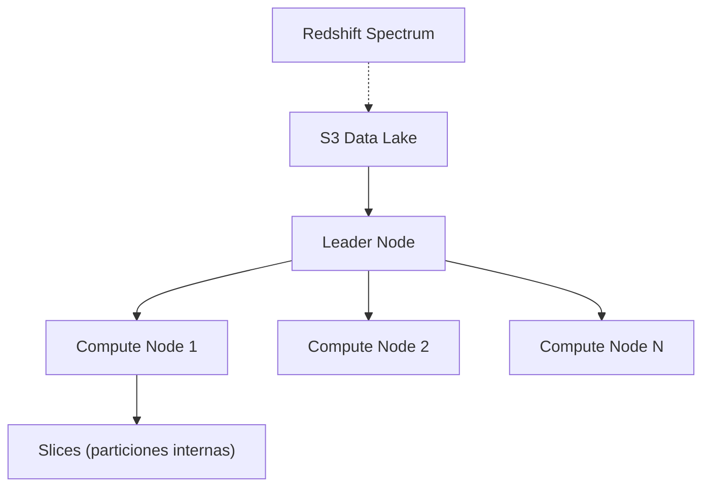

# 🏢 AWS Redshift - Ayuda Memoria para Ingenieros de Datos

## 1. 🧠 Arquitectura



| Concepto | Descripción |
| :--- | :--- |
| **Leader Node** | Recibe queries, planifica ejecución, combina resultados |
| **Compute Node** | Almacena datos y ejecuta queries en paralelo |
| **Slice** | Subdivisión de un compute node (paralelismo interno) |
| **Distribution Style** | Cómo se reparten datos entre nodos (KEY, EVEN, ALL, AUTO) |
| **Sort Key** | Orden físico de los datos en disco (optimiza WHERE) |
| **Redshift Spectrum** | Consultar datos directamente en S3 sin cargarlos |
| **Serverless** | Redshift sin administrar clusters (pago por uso) |

---

## 2. 📋 DDL Optimizado

### Distribution Styles
```sql
-- KEY: Datos con la misma key van al mismo nodo (ideal para JOINs frecuentes)
CREATE TABLE fact_transacciones (
    txn_id BIGINT IDENTITY(1,1),
    fecha DATE,
    cliente_id BIGINT,
    cuenta_id BIGINT,
    monto DECIMAL(15,2),
    tipo VARCHAR(20)
)
DISTKEY(cliente_id)          -- JOINs frecuentes por cliente
SORTKEY(fecha)               -- Queries siempre filtran por fecha
;

-- ALL: Tabla pequeña copiada a todos los nodos (dimensiones)
CREATE TABLE dim_tipo_transaccion (
    tipo_id INT,
    nombre VARCHAR(50),
    categoria VARCHAR(30)
)
DISTSTYLE ALL;               -- Pequeña, usada en muchos JOINs

-- EVEN: Distribución uniforme (tablas sin key de join clara)
CREATE TABLE logs_audit (
    log_id BIGINT,
    timestamp TIMESTAMP,
    accion VARCHAR(100)
)
DISTSTYLE EVEN;
```

### Sort Keys
```sql
-- Compound Sort Key (para queries con prefijo)
CREATE TABLE transacciones (...)
COMPOUND SORTKEY(fecha, tipo, region);
-- Optimiza: WHERE fecha = X AND tipo = Y
-- NO optimiza: WHERE tipo = Y (sin fecha)

-- Interleaved Sort Key (para queries con cualquier combinación)
CREATE TABLE transacciones (...)
INTERLEAVED SORTKEY(fecha, tipo, region);
-- Optimiza: cualquier combinación de estas columnas
-- Más costoso de mantener (VACUUM más lento)
```

---

## 3. 📥 Carga de Datos (COPY)

```sql
-- COPY desde S3 (el método más rápido)
COPY fact_transacciones
FROM 's3://banco-datalake/curated/transacciones/'
IAM_ROLE 'arn:aws:iam::123:role/RedshiftS3Role'
FORMAT AS PARQUET;

-- COPY CSV con opciones
COPY staging_clientes
FROM 's3://banco-datalake/landing/clientes.csv'
IAM_ROLE 'arn:aws:iam::123:role/RedshiftS3Role'
CSV
IGNOREHEADER 1
DELIMITER ','
DATEFORMAT 'YYYY-MM-DD'
MAXERROR 100
REGION 'us-east-1'
GZIP;

-- COPY desde múltiples archivos (manifest)
COPY staging_transacciones
FROM 's3://banco-datalake/manifests/txn_2026-02-12.manifest'
IAM_ROLE 'arn:aws:iam::123:role/RedshiftS3Role'
FORMAT AS PARQUET
MANIFEST;

-- UNLOAD (exportar a S3)
UNLOAD ('SELECT * FROM analytics.resumen_mensual WHERE anio = 2026')
TO 's3://banco-datalake/exports/resumen_2026_'
IAM_ROLE 'arn:aws:iam::123:role/RedshiftS3Role'
FORMAT AS PARQUET
PARALLEL ON
MAXFILESIZE 256 MB;

-- Ver errores de COPY
SELECT * FROM stl_load_errors ORDER BY starttime DESC LIMIT 20;
```

---

## 4. 🔍 Redshift Spectrum (Query S3)

```sql
-- Crear schema externo
CREATE EXTERNAL SCHEMA lake
FROM DATA CATALOG
DATABASE 'banco_curated'
IAM_ROLE 'arn:aws:iam::123:role/SpectrumRole';

-- Consultar datos en S3 como si fuera una tabla local
SELECT t.tipo, COUNT(*), SUM(t.monto) AS total
FROM lake.transacciones t          -- Datos en S3 via Spectrum
JOIN public.dim_cliente c          -- Datos locales en Redshift
ON t.cliente_id = c.cliente_id
WHERE t.year = 2026 AND t.month = 2
GROUP BY t.tipo;
```

> [!TIP] Consejo
> Usa Spectrum para datos históricos fríos en S3 y mantén solo datos calientes en Redshift local.

---

## 5. ⚡ Optimización

### Maintenance
```sql
-- VACUUM: reorganiza datos y recupera espacio
VACUUM FULL transacciones;       -- Completo
VACUUM DELETE ONLY transacciones; -- Solo recuperar espacio de deletes
VACUUM SORT ONLY transacciones;   -- Solo re-sortear

-- ANALYZE: actualiza estadísticas para el optimizer
ANALYZE transacciones;
ANALYZE PREDICATE COLUMNS transacciones;  -- Solo columnas usadas en WHERE

-- Ver tablas que necesitan VACUUM
SELECT "table", unsorted, "rows", tbl_rows
FROM svv_table_info
WHERE unsorted > 5
ORDER BY unsorted DESC;
```

### Monitoreo
```sql
-- Queries más lentas
SELECT query, TRIM(querytxt) AS sql, starttime, endtime,
       DATEDIFF(second, starttime, endtime) AS duracion_seg
FROM stl_query
WHERE endtime > DATEADD(hour, -24, GETDATE())
ORDER BY duracion_seg DESC LIMIT 20;

-- Uso de disco por tabla
SELECT "table", size AS size_mb, pct_used
FROM svv_table_info
ORDER BY size DESC LIMIT 20;

-- Conexiones activas
SELECT * FROM stv_sessions WHERE user_name != 'rdsdb';

-- Queue de queries (WLM)
SELECT * FROM stv_wlm_query_state;
```

### WLM (Workload Management)
```sql
-- Crear cola para queries pesadas de ETL
CREATE WLM QUEUE etl_queue
  WITH (memory_percent=50, concurrency=5, timeout=3600);

-- Crear cola para queries rápidas de BI
CREATE WLM QUEUE bi_queue
  WITH (memory_percent=30, concurrency=20, timeout=300);
```

---

## 6. 🔒 Seguridad para Banca

```sql
-- Crear usuarios con permisos limitados
CREATE USER analyst PASSWORD 'Str0ng_P@ss!' NOCREATEDB;
CREATE GROUP data_analysts;
ALTER GROUP data_analysts ADD USER analyst;

-- Permisos granulares
GRANT USAGE ON SCHEMA analytics TO GROUP data_analysts;
GRANT SELECT ON ALL TABLES IN SCHEMA analytics TO GROUP data_analysts;

-- Column-Level Access Control
GRANT SELECT (nombre, segmento, region) ON dim_cliente TO GROUP data_analysts;
-- No pueden ver: email, telefono, rut

-- Row-Level Security (RLS)
CREATE RLS POLICY filtro_region
WITH (region VARCHAR(10))
USING (region = CURRENT_USER_ATTRIBUTE('region'));

ATTACH RLS POLICY filtro_region ON fact_transacciones;
```

---

## 🧭 Navegación

Vuelve al [[Índice AWS|Índice AWS]]
Relacionado: [[AWS S3 y Data Lake|S3]] | [[AWS Glue|Glue]] | [[AWS IAM y Seguridad Bancaria|Seguridad]]
