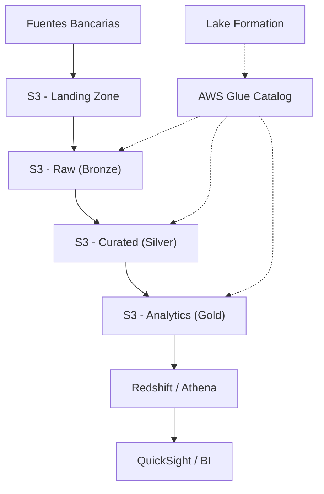

# 🪣 AWS S3 y Data Lake - Ayuda Memoria para Banca

## 1. 🧠 Arquitectura Data Lake en AWS



---

## 2. 🪣 S3 Operaciones Esenciales

### CLI
```bash
# Listar buckets
aws s3 ls

# Listar contenido con detalles
aws s3 ls s3://banco-datalake/raw/ --recursive --human-readable --summarize

# Copiar archivos
aws s3 cp archivo.csv s3://banco-datalake/landing/
aws s3 cp s3://banco-datalake/raw/datos.parquet ./local/

# Sincronizar directorio completo
aws s3 sync ./datos_diarios/ s3://banco-datalake/landing/transacciones/2026/02/12/

# Mover (renombrar)
aws s3 mv s3://banco-datalake/landing/ s3://banco-datalake/raw/ --recursive

# Eliminar
aws s3 rm s3://banco-datalake/temp/ --recursive

# Crear bucket
aws s3 mb s3://banco-datalake-prod --region us-east-1

# Ver tamaño de un prefijo
aws s3 ls s3://banco-datalake/raw/ --recursive --summarize | tail -2
```

### SDK Python (boto3)
```python
import boto3
import json

s3 = boto3.client('s3')

# Listar objetos
response = s3.list_objects_v2(Bucket='banco-datalake', Prefix='raw/transacciones/')
for obj in response.get('Contents', []):
    print(f"{obj['Key']} - {obj['Size']} bytes - {obj['LastModified']}")

# Subir archivo
s3.upload_file('datos.parquet', 'banco-datalake', 'raw/transacciones/2026-02-12/datos.parquet')

# Descargar archivo
s3.download_file('banco-datalake', 'raw/datos.parquet', 'local_datos.parquet')

# Leer JSON directamente desde S3
response = s3.get_object(Bucket='banco-datalake', Key='config/pipeline.json')
config = json.loads(response['Body'].read().decode('utf-8'))

# Generar URL pre-firmada (acceso temporal)
url = s3.generate_presigned_url('get_object',
    Params={'Bucket': 'banco-datalake', 'Key': 'reportes/mensual.pdf'},
    ExpiresIn=3600  # 1 hora
)
```

---

## 3. 📂 Estructura de Carpetas para Banca

```
banco-datalake/
├── landing/                    # Datos que acaban de llegar
│   ├── core-banking/
│   ├── tarjetas/
│   └── riesgo/
├── raw/                        # Bronze - Datos crudos preservados
│   ├── transacciones/
│   │   └── year=2026/month=02/day=12/
│   ├── clientes/
│   ├── cuentas/
│   └── creditos/
├── curated/                    # Silver - Limpio y tipado
│   ├── transacciones/
│   ├── clientes_unificados/
│   └── posicion_consolidada/
├── analytics/                  # Gold - Modelos listos
│   ├── dim_cliente/
│   ├── dim_producto/
│   ├── fact_transacciones/
│   └── met_kpi_diario/
├── sandbox/                    # Experimentación
└── logs/                       # Logs de pipelines
```

---

## 4. 🔒 Seguridad S3 para Banca

> [!CAUTION] Regulación Bancaria
> Los datos financieros requieren encriptación en reposo Y en tránsito. Siempre usar SSE-KMS para datos sensibles.

### Encriptación
```bash
# Encriptación por defecto con KMS
aws s3api put-bucket-encryption \
  --bucket banco-datalake \
  --server-side-encryption-configuration '{
    "Rules": [{
      "ApplyServerSideEncryptionByDefault": {
        "SSEAlgorithm": "aws:kms",
        "KMSMasterKeyID": "arn:aws:kms:us-east-1:123456:key/abcd-1234"
      },
      "BucketKeyEnabled": true
    }]
  }'
```

### Bucket Policy (bloquear acceso público)
```json
{
    "Version": "2012-10-17",
    "Statement": [
        {
            "Sid": "BloqueoPúblico",
            "Effect": "Deny",
            "Principal": "*",
            "Action": "s3:*",
            "Resource": [
                "arn:aws:s3:::banco-datalake",
                "arn:aws:s3:::banco-datalake/*"
            ],
            "Condition": {
                "Bool": {"aws:SecureTransport": "false"}
            }
        }
    ]
}
```

### Lifecycle Rules (gestión de costos)
```json
{
    "Rules": [
        {
            "ID": "MoverAGlacier",
            "Filter": {"Prefix": "raw/"},
            "Status": "Enabled",
            "Transitions": [
                {"Days": 90, "StorageClass": "GLACIER"},
                {"Days": 365, "StorageClass": "DEEP_ARCHIVE"}
            ]
        },
        {
            "ID": "EliminarTemporal",
            "Filter": {"Prefix": "sandbox/"},
            "Status": "Enabled",
            "Expiration": {"Days": 30}
        }
    ]
}
```

### Clases de Almacenamiento

| Clase | Uso | Costo / GB |
| :--- | :--- | :--- |
| **S3 Standard** | Datos activos (Gold, Silver) | $$$ |
| **S3 IA** | Acceso infrecuente (Raw > 30 días) | $$ |
| **S3 Glacier** | Archivos (Raw > 90 días) | $ |
| **S3 Deep Archive** | Regulatorio / Compliance (> 1 año) | ¢ |

---

## 5. 🔍 AWS Athena (SQL sobre S3)

```sql
-- Crear tabla sobre Parquet en S3
CREATE EXTERNAL TABLE transacciones (
    txn_id BIGINT,
    fecha DATE,
    monto DECIMAL(15,2),
    tipo STRING,
    cuenta_origen STRING,
    cuenta_destino STRING
)
PARTITIONED BY (year INT, month INT, day INT)
STORED AS PARQUET
LOCATION 's3://banco-datalake/curated/transacciones/'
TBLPROPERTIES ('parquet.compression'='SNAPPY');

-- Cargar particiones
MSCK REPAIR TABLE transacciones;

-- Query con filtro de partición (reduce costo)
SELECT tipo, COUNT(*) AS total, SUM(monto) AS monto_total
FROM transacciones
WHERE year = 2026 AND month = 2
GROUP BY tipo
ORDER BY monto_total DESC;

-- CTAS (Create Table As Select) - optimizar formato
CREATE TABLE analytics.txn_optimizada
WITH (
    format = 'PARQUET',
    external_location = 's3://banco-datalake/analytics/txn_optimizada/',
    partitioned_by = ARRAY['year', 'month'],
    bucketed_by = ARRAY['cuenta_origen'],
    bucket_count = 10
) AS
SELECT * FROM transacciones WHERE year >= 2025;
```

---

## 6. 🏗️ AWS Lake Formation

```python
import boto3

lf = boto3.client('lakeformation')

# Registrar bucket como Data Lake Location
lf.register_resource(
    ResourceArn='arn:aws:s3:::banco-datalake',
    UseServiceLinkedRole=True
)

# Otorgar permisos granulares
lf.grant_permissions(
    Principal={'DataLakePrincipalIdentifier': 'arn:aws:iam::123:role/AnalystRole'},
    Resource={
        'Table': {
            'DatabaseName': 'analytics',
            'Name': 'fact_transacciones'
        }
    },
    Permissions=['SELECT'],
    PermissionsWithGrantOption=[]
)

# Column-level security (ocultar columnas sensibles)
lf.grant_permissions(
    Principal={'DataLakePrincipalIdentifier': 'arn:aws:iam::123:role/JuniorAnalyst'},
    Resource={
        'TableWithColumns': {
            'DatabaseName': 'analytics',
            'Name': 'dim_cliente',
            'ColumnNames': ['nombre', 'segmento', 'region'],  # Solo estas columnas
            'ColumnWildcard': {}  # Excluir: email, telefono, rut
        }
    },
    Permissions=['SELECT']
)
```

---

## 🧭 Navegación

Vuelve al [[Índice AWS|Índice AWS]]
Relacionado: [[AWS Glue|Glue]] | [[AWS Redshift|Redshift]] | [[AWS IAM y Seguridad Bancaria|Seguridad]]
