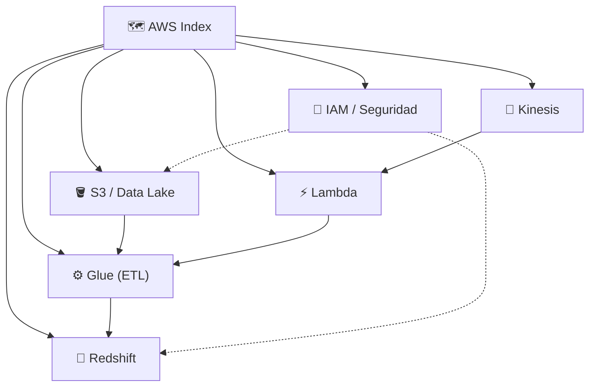
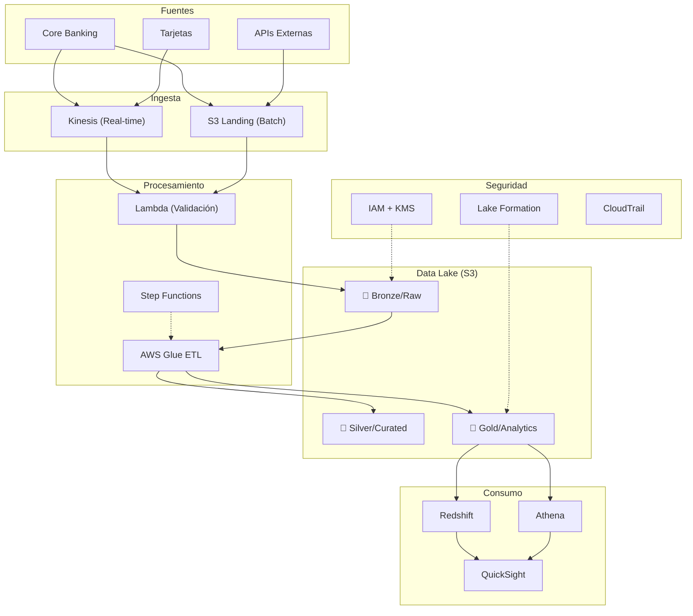

# 🗺️ Índice AWS para Data Engineering Bancario

> [!NOTE] Mapa de Contenido (MOC)
> Guías específicas de AWS orientadas a Data Engineering en el sector bancario.

---

## 📚 Servicios de Data

| # | Guía | Descripción |
| :--- | :--- | :--- |
| 1 | [[AWS S3 y Data Lake]] | Buckets, Athena, Lake Formation, lifecycle, estructura bancaria |
| 2 | [[AWS Glue]] | Crawlers, ETL Jobs PySpark, Data Quality, Workflows |
| 3 | [[AWS Redshift]] | DDL optimizado, COPY/UNLOAD, Spectrum, WLM, RLS |
| 4 | [[AWS Kinesis]] | Data Streams, Firehose, detección de fraude en tiempo real |
| 5 | [[AWS Lambda y Serverless]] | Triggers S3, Step Functions, EventBridge |
| 6 | [[AWS IAM y Seguridad Bancaria]] | KMS, Secrets Manager, CloudTrail, compliance SOC2/PCI |

---

## 🏦 Arquitectura de Referencia para Banca

---

## 🏷️ Tags
#aws #s3 #glue #redshift #kinesis #lambda #iam #seguridad #banca #data-lake

---

## 🔗 Relacionado en el Vault
- [[Índice Data Engineering|📊 Índice General Data Engineering]]
- [[Terraform para Data|🏗️ Terraform para Data]]
- [[Comandos Cloud y CLI|☁️ CLI AWS]]
- [[Arquitectura Medallion|🥇 Medallion Architecture]]
