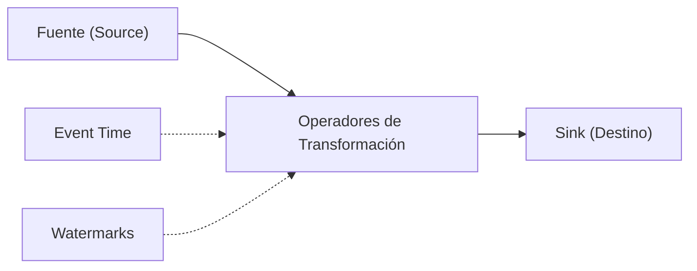
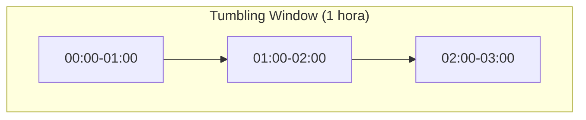

# 🌊 Apache Flink - Ayuda Memoria para Ingenieros de Datos

## 1. 🧠 Conceptos Fundamentales



| Concepto | Descripción |
| :--- | :--- |
| **Stream** | Flujo continuo e ilimitado de datos |
| **Batch** | Caso especial de stream con límites definidos |
| **Event Time** | Timestamp del evento cuando ocurrió en la fuente |
| **Processing Time** | Timestamp cuando Flink procesa el evento |
| **Watermark** | Marca que indica hasta qué punto los eventos han llegado |
| **Window** | Agrupación temporal de eventos para procesamiento |
| **State** | Datos intermedios almacenados por Flink entre eventos |
| **Checkpoint** | Snapshot periódico del estado para tolerancia a fallos |
| **Savepoint** | Checkpoint manual para upgrades y migraciones |

> [!IMPORTANT] ¿Cuándo usar Flink vs Spark Streaming?
> - **Flink**: Procesamiento evento-por-evento con latencia ultra-baja (ms)
> - **Spark Streaming**: Micro-batches con latencia de segundos, mejor integración con batch

---

## 2. 📋 Flink SQL

```sql
-- Crear tabla desde Kafka
CREATE TABLE ventas_stream (
    id BIGINT,
    producto STRING,
    monto DOUBLE,
    ts TIMESTAMP(3),
    WATERMARK FOR ts AS ts - INTERVAL '5' SECOND
) WITH (
    'connector' = 'kafka',
    'topic' = 'ventas',
    'properties.bootstrap.servers' = 'localhost:9092',
    'format' = 'json',
    'scan.startup.mode' = 'latest-offset'
);

-- Ventana tumbling (intervalos fijos sin solapamiento)
SELECT 
    TUMBLE_START(ts, INTERVAL '1' HOUR) AS ventana_inicio,
    producto,
    COUNT(*) AS total_ventas,
    SUM(monto) AS monto_total
FROM ventas_stream
GROUP BY TUMBLE(ts, INTERVAL '1' HOUR), producto;

-- Ventana sliding (intervalos con solapamiento)
SELECT 
    HOP_START(ts, INTERVAL '5' MINUTE, INTERVAL '1' HOUR) AS ventana_inicio,
    COUNT(*) AS eventos
FROM ventas_stream
GROUP BY HOP(ts, INTERVAL '5' MINUTE, INTERVAL '1' HOUR);

-- Ventana de sesión (agrupa por actividad)
SELECT 
    SESSION_START(ts, INTERVAL '30' MINUTE) AS sesion_inicio,
    usuario_id,
    COUNT(*) AS acciones
FROM clicks_stream
GROUP BY SESSION(ts, INTERVAL '30' MINUTE), usuario_id;

-- Sink a otra tabla/sistema
INSERT INTO resumen_ventas
SELECT producto, SUM(monto) FROM ventas_stream
GROUP BY TUMBLE(ts, INTERVAL '1' HOUR), producto;
```

---

## 3. 🐍 PyFlink (Python API)

```python
from pyflink.table import EnvironmentSettings, TableEnvironment
from pyflink.table.expressions import col, lit
from pyflink.table.window import Tumble

# Configurar entorno
env_settings = EnvironmentSettings.in_streaming_mode()
t_env = TableEnvironment.create(env_settings)

# Configuración
t_env.get_config().set("parallelism.default", "4")
t_env.get_config().set("state.checkpoints.dir", "s3://bucket/checkpoints")

# Crear tabla fuente desde Kafka
t_env.execute_sql("""
    CREATE TABLE ventas (
        id BIGINT,
        producto STRING,
        monto DOUBLE,
        ts TIMESTAMP(3),
        WATERMARK FOR ts AS ts - INTERVAL '5' SECOND
    ) WITH (
        'connector' = 'kafka',
        'topic' = 'ventas',
        'properties.bootstrap.servers' = 'localhost:9092',
        'format' = 'json'
    )
""")

# Crear tabla destino
t_env.execute_sql("""
    CREATE TABLE resumen (
        ventana_inicio TIMESTAMP(3),
        producto STRING,
        total_ventas BIGINT,
        monto_total DOUBLE
    ) WITH (
        'connector' = 'jdbc',
        'url' = 'jdbc:postgresql://localhost:5432/analytics',
        'table-name' = 'resumen_ventas',
        'username' = 'admin',
        'password' = 'secreto'
    )
""")

# Procesamiento
ventas = t_env.from_path("ventas")
resultado = ventas \
    .window(Tumble.over(lit(1).hours).on(col("ts")).alias("w")) \
    .group_by(col("w"), col("producto")) \
    .select(
        col("w").start.alias("ventana_inicio"),
        col("producto"),
        col("id").count.alias("total_ventas"),
        col("monto").sum.alias("monto_total")
    )

resultado.execute_insert("resumen")
```

---

## 4. 🪟 Tipos de Ventanas



| Tipo | Descripción | Uso |
| :--- | :--- | :--- |
| **Tumbling** | Intervalos fijos sin solapamiento | Reportes por hora/día |
| **Sliding** | Intervalos con solapamiento | Promedios móviles |
| **Session** | Agrupa por actividad del usuario | Análisis de sesiones |
| **Global** | Sin límite temporal, trigger custom | Acumulados |

---

## 5. 🛡️ Checkpoints y Tolerancia a Fallos

```python
# Configurar checkpoints
t_env.get_config().set("execution.checkpointing.interval", "60000")  # 60s
t_env.get_config().set("execution.checkpointing.mode", "EXACTLY_ONCE")
t_env.get_config().set("execution.checkpointing.min-pause", "30000")
t_env.get_config().set("state.backend", "rocksdb")
t_env.get_config().set("state.checkpoints.dir", "s3://bucket/checkpoints")
```

```bash
# Savepoints manuales
flink savepoint <job-id> s3://bucket/savepoints/
flink run -s s3://bucket/savepoints/savepoint-xxx app.jar  # Restaurar
flink cancel <job-id>                                        # Cancelar job
flink list                                                   # Listar jobs
```

---

## 6. 🐳 Flink con Docker Compose

```yaml
version: '3.8'
services:
  jobmanager:
    image: flink:1.18
    ports:
      - "8081:8081"
    command: jobmanager
    environment:
      FLINK_PROPERTIES: |
        jobmanager.rpc.address: jobmanager
        state.backend: rocksdb
        state.checkpoints.dir: file:///checkpoints

  taskmanager:
    image: flink:1.18
    depends_on:
      - jobmanager
    command: taskmanager
    environment:
      FLINK_PROPERTIES: |
        jobmanager.rpc.address: jobmanager
        taskmanager.numberOfTaskSlots: 4
        taskmanager.memory.process.size: 4g
    scale: 2
```

---

## 🧭 Navegación

Vuelve al [[Índice Data Engineering|Índice]]
Relacionado: [[Apache Kafka|Kafka]] | [[Apache Spark|Spark]] | [[ETL y Pipelines|ETL]]
