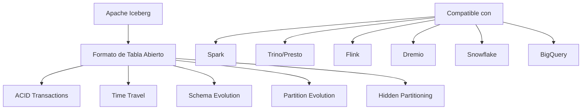
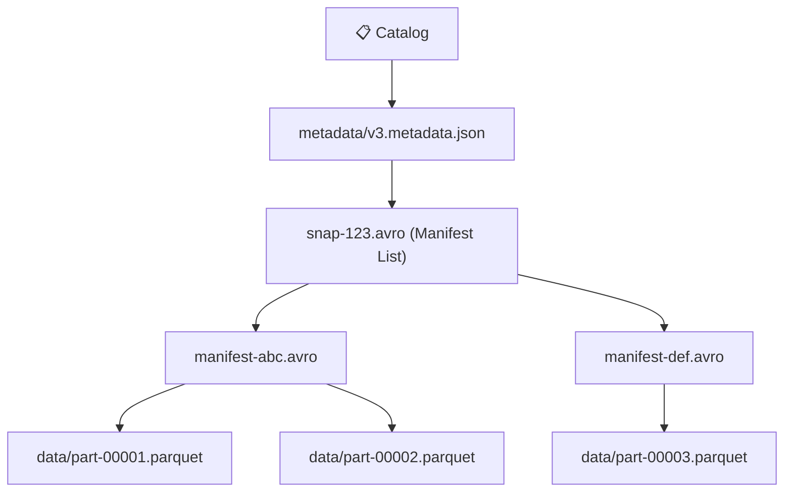

# 🧊 Apache Iceberg - Ayuda Memoria para Ingenieros de Datos

## 1. 🧠 ¿Qué es Apache Iceberg?

> [!NOTE] Definición
> Apache Iceberg es un **formato de tabla abierto** para datasets analíticos masivos. Agrega funcionalidades de data warehouse (transacciones ACID, time travel, schema evolution) sobre tu Data Lake.



| Concepto | Descripción |
| :--- | :--- |
| **Catalog** | Registro central de tablas Iceberg (Hive, AWS Glue, Nessie, REST) |
| **Metadata Layer** | Archivos JSON/Avro que rastrean snapshots, manifests y data files |
| **Snapshot** | Estado inmutable de la tabla en un punto del tiempo |
| **Manifest List** | Lista de manifests que componen un snapshot |
| **Manifest File** | Lista de data files con estadísticas (min/max por columna) |
| **Data Files** | Archivos Parquet/ORC/Avro con los datos reales |
| **Partition Spec** | Define cómo se particionan los datos (puede evolucionar) |

---

## 2. 🏗️ Arquitectura de Archivos



> [!TIP] Ventaja clave
> Iceberg NO depende de la estructura de directorios para las particiones (a diferencia de Hive). Las particiones son **metadata**, lo que permite cambiarlas sin reescribir datos.

---

## 3. ⚡ Iceberg con PySpark

### Configuración
```python
from pyspark.sql import SparkSession

spark = SparkSession.builder \
    .appName("IcebergApp") \
    .config("spark.jars.packages", "org.apache.iceberg:iceberg-spark-runtime-3.5_2.12:1.5.0") \
    .config("spark.sql.extensions", "org.apache.iceberg.spark.extensions.IcebergSparkSessionExtensions") \
    .config("spark.sql.catalog.mi_catalogo", "org.apache.iceberg.spark.SparkCatalog") \
    .config("spark.sql.catalog.mi_catalogo.type", "hadoop") \
    .config("spark.sql.catalog.mi_catalogo.warehouse", "s3://mi-bucket/warehouse") \
    .getOrCreate()
```

### Operaciones CRUD
```python
# Crear tabla
spark.sql("""
    CREATE TABLE mi_catalogo.db.ventas (
        id BIGINT,
        fecha DATE,
        producto STRING,
        monto DOUBLE,
        region STRING
    )
    USING iceberg
    PARTITIONED BY (days(fecha), region)
""")

# Insertar datos
spark.sql("""
    INSERT INTO mi_catalogo.db.ventas VALUES
    (1, DATE'2026-02-01', 'Widget', 99.99, 'LATAM'),
    (2, DATE'2026-02-01', 'Gadget', 149.99, 'EMEA')
""")

# Leer datos
df = spark.table("mi_catalogo.db.ventas")
df.show()

# Update (¡sí, UPDATE en un Data Lake!)
spark.sql("""
    UPDATE mi_catalogo.db.ventas
    SET monto = 109.99
    WHERE id = 1
""")

# Delete
spark.sql("""
    DELETE FROM mi_catalogo.db.ventas
    WHERE fecha < DATE'2025-01-01'
""")

# Merge (Upsert)
spark.sql("""
    MERGE INTO mi_catalogo.db.ventas t
    USING staging s
    ON t.id = s.id
    WHEN MATCHED THEN UPDATE SET *
    WHEN NOT MATCHED THEN INSERT *
""")
```

---

## 4. ⏪ Time Travel

```sql
-- Ver historial de snapshots
SELECT * FROM mi_catalogo.db.ventas.snapshots;

-- Consultar un snapshot específico
SELECT * FROM mi_catalogo.db.ventas VERSION AS OF 123456789;

-- Consultar por timestamp
SELECT * FROM mi_catalogo.db.ventas TIMESTAMP AS OF '2026-02-01 10:00:00';

-- Rollback a un snapshot anterior
CALL mi_catalogo.system.rollback_to_snapshot('db.ventas', 123456789);

-- Rollback por timestamp
CALL mi_catalogo.system.rollback_to_timestamp('db.ventas', TIMESTAMP '2026-02-01 10:00:00');
```

---

## 5. 🔄 Schema y Partition Evolution

> [!IMPORTANT] Evolución sin downtime
> Iceberg permite cambiar el esquema y las particiones **sin reescribir datos**. Esto es una ventaja enorme sobre Hive.

### Schema Evolution
```sql
-- Agregar columna
ALTER TABLE mi_catalogo.db.ventas ADD COLUMN categoria STRING;

-- Renombrar columna
ALTER TABLE mi_catalogo.db.ventas RENAME COLUMN monto TO monto_total;

-- Cambiar tipo (si es compatible)
ALTER TABLE mi_catalogo.db.ventas ALTER COLUMN id TYPE BIGINT;

-- Eliminar columna
ALTER TABLE mi_catalogo.db.ventas DROP COLUMN categoria;

-- Reordenar columnas
ALTER TABLE mi_catalogo.db.ventas ALTER COLUMN region AFTER producto;
```

### Partition Evolution
```sql
-- Cambiar estrategia de partición (sin reescribir datos existentes)
-- Los datos nuevos usarán la nueva estrategia
ALTER TABLE mi_catalogo.db.ventas
ADD PARTITION FIELD months(fecha);  -- Cambiar de días a meses

-- Eliminar campo de partición
ALTER TABLE mi_catalogo.db.ventas
DROP PARTITION FIELD region;
```

### Tipos de Partición (Hidden Partitioning)

| Transformación | Ejemplo | Descripción |
| :--- | :--- | :--- |
| `identity` | `region` | Valor exacto |
| `years(col)` | `years(fecha)` | Por año |
| `months(col)` | `months(fecha)` | Por año-mes |
| `days(col)` | `days(fecha)` | Por fecha |
| `hours(col)` | `hours(timestamp)` | Por hora |
| `bucket(N, col)` | `bucket(16, id)` | Hash en N buckets |
| `truncate(L, col)` | `truncate(4, codigo)` | Primeros L caracteres |

---

## 6. 🧹 Mantenimiento

```sql
-- Compactación de archivos pequeños (CRITICAL para performance)
CALL mi_catalogo.system.rewrite_data_files(
    table => 'db.ventas',
    strategy => 'sort',
    sort_order => 'region ASC, fecha DESC'
);

-- Limpiar snapshots antiguos (liberar espacio)
CALL mi_catalogo.system.expire_snapshots(
    table => 'db.ventas',
    older_than => TIMESTAMP '2026-01-01 00:00:00',
    retain_last => 5
);

-- Eliminar archivos de metadata huérfanos
CALL mi_catalogo.system.remove_orphan_files(
    table => 'db.ventas'
);

-- Reescribir manifests para optimizar
CALL mi_catalogo.system.rewrite_manifests('db.ventas');
```

> [!WARNING] Advertencia
> Sin compactación periódica, Iceberg acumula miles de archivos pequeños que degradan la performance. Programa `rewrite_data_files` regularmente.

---

## 7. 📊 Iceberg vs Otros Formatos

| Característica | Iceberg | Delta Lake | Hudi |
| :--- | :--- | :--- | :--- |
| **Transacciones ACID** | ✅ | ✅ | ✅ |
| **Time Travel** | ✅ | ✅ | ✅ |
| **Schema Evolution** | ✅ Completa | ✅ Parcial | ✅ Parcial |
| **Partition Evolution** | ✅ Sin reescribir | ❌ Requiere reescribir | ❌ |
| **Hidden Partitioning** | ✅ | ❌ | ❌ |
| **Motor agnóstico** | ✅ Spark, Trino, Flink | ⚠️ Principalmente Spark | ⚠️ Principalmente Spark |
| **Adopción Cloud** | AWS, GCP, Snowflake | Databricks | AWS (EMR) |

---

## 🧭 Navegación

Vuelve al [[Índice Data Engineering|Índice]]
Relacionado: [[Snowflake|Snowflake]] | [[BigQuery|BigQuery]] | [[Python para Data Engineering|Python]]
