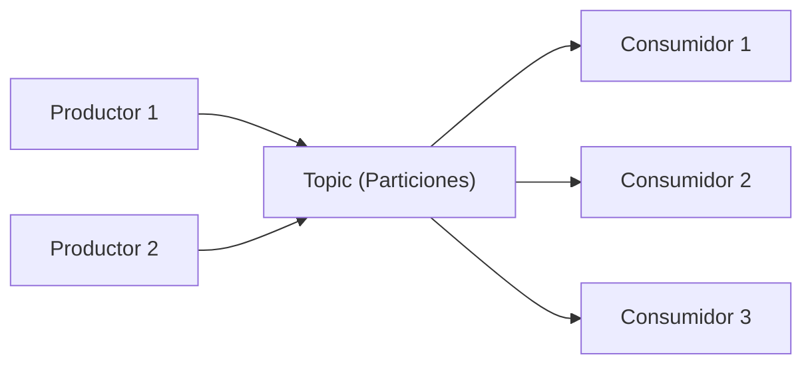

# 📨 Apache Kafka - Ayuda Memoria para Ingenieros de Datos

## 1. 🧠 Conceptos Fundamentales



| Concepto | Descripción |
| :--- | :--- |
| **Topic** | Canal lógico donde se publican mensajes (como una tabla de logs) |
| **Partición** | Subdivisión de un topic para paralelismo. Cada partición es ordenada |
| **Offset** | Posición de un mensaje dentro de una partición |
| **Productor** | Envía mensajes a un topic |
| **Consumidor** | Lee mensajes de un topic |
| **Consumer Group** | Grupo de consumidores que se reparten las particiones |
| **Broker** | Servidor Kafka que almacena y sirve datos |
| **Replication Factor** | Número de copias de cada partición (alta disponibilidad) |
| **Retention** | Tiempo que Kafka guarda los mensajes (default: 7 días) |

---

## 2. 🛠️ Comandos CLI de Kafka

### Topics
```bash
# Crear topic
kafka-topics.sh --bootstrap-server localhost:9092 \
  --create --topic ventas \
  --partitions 6 --replication-factor 3

# Listar topics
kafka-topics.sh --bootstrap-server localhost:9092 --list

# Describir topic (particiones, réplicas, ISR)
kafka-topics.sh --bootstrap-server localhost:9092 \
  --describe --topic ventas

# Modificar particiones (solo se puede aumentar)
kafka-topics.sh --bootstrap-server localhost:9092 \
  --alter --topic ventas --partitions 12

# Eliminar topic
kafka-topics.sh --bootstrap-server localhost:9092 \
  --delete --topic ventas
```

### Producir y Consumir (Debug)
```bash
# Producir mensajes manualmente
kafka-console-producer.sh --bootstrap-server localhost:9092 \
  --topic ventas \
  --property "key.separator=:" \
  --property "parse.key=true"

# Consumir desde el inicio
kafka-console-consumer.sh --bootstrap-server localhost:9092 \
  --topic ventas --from-beginning

# Consumir con grupo
kafka-console-consumer.sh --bootstrap-server localhost:9092 \
  --topic ventas --group mi_grupo

# Ver lag de un consumer group
kafka-consumer-groups.sh --bootstrap-server localhost:9092 \
  --describe --group mi_grupo
```

---

## 3. 🐍 Kafka con Python

### Productor
```python
from confluent_kafka import Producer
import json

config = {
    'bootstrap.servers': 'localhost:9092',
    'client.id': 'mi-productor',
    'acks': 'all',                    # Garantía de entrega
    'retries': 5,
    'linger.ms': 10,                  # Batching para performance
    'batch.size': 32768,
}

producer = Producer(config)

def callback(err, msg):
    if err:
        print(f"Error: {err}")
    else:
        print(f"Enviado a {msg.topic()} [{msg.partition()}] offset {msg.offset()}")

# Enviar mensajes
for venta in ventas:
    producer.produce(
        topic='ventas',
        key=str(venta['id']),
        value=json.dumps(venta),
        callback=callback
    )

producer.flush()  # Esperar a que se envíen todos
```

### Consumidor
```python
from confluent_kafka import Consumer
import json

config = {
    'bootstrap.servers': 'localhost:9092',
    'group.id': 'pipeline-ventas',
    'auto.offset.reset': 'earliest',  # Leer desde el inicio si es nuevo
    'enable.auto.commit': False,      # Commit manual para control
}

consumer = Consumer(config)
consumer.subscribe(['ventas'])

try:
    while True:
        msg = consumer.poll(timeout=1.0)
        if msg is None:
            continue
        if msg.error():
            print(f"Error: {msg.error()}")
            continue
        
        dato = json.loads(msg.value().decode('utf-8'))
        print(f"Recibido: {dato}")
        
        # Procesar dato aquí...
        
        consumer.commit()  # Confirmar procesamiento
finally:
    consumer.close()
```

---

## 4. 🐳 Kafka con Docker Compose

```yaml
version: '3.8'
services:
  zookeeper:
    image: confluentinc/cp-zookeeper:7.6.0
    environment:
      ZOOKEEPER_CLIENT_PORT: 2181
    ports:
      - "2181:2181"

  kafka:
    image: confluentinc/cp-kafka:7.6.0
    depends_on:
      - zookeeper
    ports:
      - "9092:9092"
    environment:
      KAFKA_BROKER_ID: 1
      KAFKA_ZOOKEEPER_CONNECT: zookeeper:2181
      KAFKA_ADVERTISED_LISTENERS: PLAINTEXT://localhost:9092
      KAFKA_OFFSETS_TOPIC_REPLICATION_FACTOR: 1
      KAFKA_LOG_RETENTION_HOURS: 168    # 7 días

  kafka-ui:
    image: provectuslabs/kafka-ui:latest
    ports:
      - "8080:8080"
    environment:
      KAFKA_CLUSTERS_0_NAME: local
      KAFKA_CLUSTERS_0_BOOTSTRAPSERVERS: kafka:9092
```

---

## 5. 📐 Patrones de Diseño

> [!IMPORTANT] Semánticas de Entrega
> - **At-most-once**: Puede perder mensajes (rápido pero no confiable)
> - **At-least-once**: Puede duplicar (confiable, necesitas idempotencia)
> - **Exactly-once**: Sin pérdida ni duplicados (más lento, `enable.idempotence=true`)

### Partitioning Strategy
```
# Por key → Mismo key siempre va a misma partición (orden garantizado)
# Round-robin → Distribución uniforme (sin orden por key)
# Custom → Lógica personalizada para balancear carga
```

### Dead Letter Queue (DLQ)
```python
# Mensajes que fallan van a un topic especial para revisión
try:
    procesar(mensaje)
except Exception as e:
    producer.produce('ventas.dlq', value=json.dumps({
        'mensaje_original': mensaje,
        'error': str(e),
        'timestamp': datetime.now().isoformat()
    }))
```

---

## 6. 📊 Monitoreo Esencial

| Métrica | Descripción | Umbral de Alerta |
| :--- | :--- | :--- |
| **Consumer Lag** | Mensajes pendientes por leer | > 10,000 |
| **Under-replicated Partitions** | Particiones sin réplicas completas | > 0 |
| **Request Rate** | Requests por segundo al broker | Según capacidad |
| **Disk Usage** | Espacio en disco del broker | > 80% |

---

## 🧭 Navegación

Vuelve al [[Índice Data Engineering|Índice]]
Relacionado: [[ETL y Pipelines|ETL y Pipelines]]
