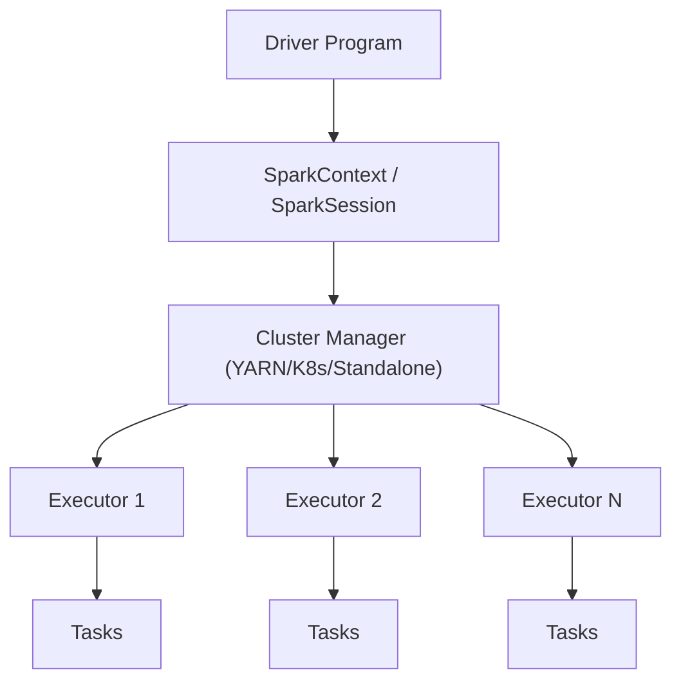

# ⚡ Apache Spark - Ayuda Memoria para Ingenieros de Datos

## 1. 🧠 Arquitectura



| Concepto | Descripción |
| :--- | :--- |
| **Driver** | Proceso principal que coordina la ejecución |
| **Executor** | Procesos que ejecutan tareas en los nodos |
| **Partition** | Fragmento de datos que un executor procesa |
| **Stage** | Conjunto de tareas que no requieren shuffle |
| **Shuffle** | Redistribución de datos entre executors (costoso) |
| **DAG** | Grafo acíclico dirigido del plan de ejecución |
| **Lazy Evaluation** | Las transformaciones no se ejecutan hasta una acción |

---

## 2. 🚀 SparkSession y Configuración

```python
from pyspark.sql import SparkSession

spark = SparkSession.builder \
    .appName("MiPipeline") \
    .master("yarn") \
    .config("spark.executor.memory", "8g") \
    .config("spark.executor.cores", "4") \
    .config("spark.executor.instances", "10") \
    .config("spark.sql.shuffle.partitions", "200") \
    .config("spark.sql.adaptive.enabled", "true") \
    .config("spark.serializer", "org.apache.spark.serializer.KryoSerializer") \
    .enableHiveSupport() \
    .getOrCreate()

# Nivel de log
spark.sparkContext.setLogLevel("WARN")
```

### Configuraciones Clave

| Config | Default | Recomendado | Descripción |
| :--- | :--- | :--- | :--- |
| `spark.executor.memory` | 1g | 4-8g | Memoria por executor |
| `spark.executor.cores` | 1 | 4-5 | Cores por executor |
| `spark.sql.shuffle.partitions` | 200 | Depende | Particiones en shuffle |
| `spark.sql.adaptive.enabled` | false | **true** | Optimización dinámica |
| `spark.sql.adaptive.coalescePartitions.enabled` | false | **true** | Fusionar particiones pequeñas |
| `spark.default.parallelism` | Cores totales | 2-3x cores | Paralelismo de RDDs |

---

## 3. 📖 Lectura y Escritura

```python
# === LECTURA ===
# CSV
df = spark.read.csv("s3://bucket/datos.csv", header=True, inferSchema=True)

# Parquet
df = spark.read.parquet("s3://bucket/datos/")

# JSON
df = spark.read.json("s3://bucket/datos.json")

# Delta Lake
df = spark.read.format("delta").load("s3://bucket/delta/")

# JDBC (Base de datos)
df = spark.read.format("jdbc") \
    .option("url", "jdbc:postgresql://host:5432/db") \
    .option("dbtable", "schema.tabla") \
    .option("user", "usuario") \
    .option("password", "secreto") \
    .option("fetchsize", "10000") \
    .load()

# Hive
df = spark.sql("SELECT * FROM database.tabla")

# === ESCRITURA ===
df.write.mode("overwrite") \
    .partitionBy("anio", "mes") \
    .parquet("s3://bucket/output/")

# Con opciones avanzadas
df.write \
    .mode("append") \
    .format("delta") \
    .option("mergeSchema", "true") \
    .save("s3://bucket/delta_output/")

# Coalesce antes de escribir (reducir archivos)
df.coalesce(10).write.parquet("s3://bucket/output/")
```

---

## 4. 🔄 Transformaciones

```python
from pyspark.sql import functions as F
from pyspark.sql.window import Window

# Seleccionar y renombrar
df.select("nombre", F.col("edad").alias("years"))
df.withColumnRenamed("old_name", "new_name")

# Filtrar
df.filter(F.col("edad") > 30)
df.where("edad > 30 AND ciudad = 'Madrid'")

# Crear columnas
df.withColumn("anio", F.year("fecha"))
df.withColumn("categoria", 
    F.when(F.col("monto") > 1000, "alto")
     .when(F.col("monto") > 500, "medio")
     .otherwise("bajo")
)

# Agregaciones
df.groupBy("departamento").agg(
    F.count("*").alias("total"),
    F.avg("salario").alias("promedio"),
    F.sum("salario").alias("nomina"),
    F.collect_list("nombre").alias("nombres")
)

# Window Functions
ventana = Window.partitionBy("dept").orderBy(F.desc("salario"))
df.withColumn("rank", F.row_number().over(ventana))
df.withColumn("acumulado", F.sum("monto").over(
    Window.partitionBy("cliente").orderBy("fecha").rowsBetween(Window.unboundedPreceding, 0)
))

# JOINs
resultado = df1.join(df2, df1.id == df2.cliente_id, "left")
resultado = df1.join(F.broadcast(df_pequeno), "id", "inner")  # Broadcast join

# Deduplicar
df.dropDuplicates(["email"])
df.dropDuplicates(["email"]).orderBy(F.desc("fecha"))

# Manejo de Nulos
df.fillna({"edad": 0, "nombre": "Desconocido"})
df.dropna(subset=["email", "nombre"])

# Explotar arrays
df.withColumn("item", F.explode("items"))

# Pivot
df.groupBy("region").pivot("mes").sum("ventas")
```

---

## 5. ⚡ Optimización

> [!WARNING] Advertencia
> Un Spark job mal optimizado puede tardar horas. Estas técnicas son esenciales.

### Broadcast Join
```python
# Para tablas pequeñas (< 10MB), evita shuffle
from pyspark.sql.functions import broadcast
resultado = df_grande.join(broadcast(df_pequeno), "id")
```

### Particionado Inteligente
```python
# Reparticionar por columna (antes de joins frecuentes)
df = df.repartition(200, "cliente_id")

# Coalesce (reducir particiones sin shuffle)
df = df.coalesce(50)

# Ver número de particiones
print(f"Particiones: {df.rdd.getNumPartitions()}")
```

### Caché y Persistencia
```python
# Cache en memoria
df.cache()  # equivale a persist(StorageLevel.MEMORY_AND_DISK)
df.count()  # Fuerza la materialización

# Liberar caché
df.unpersist()

# Persistir con nivel específico
from pyspark import StorageLevel
df.persist(StorageLevel.MEMORY_AND_DISK_SER)  # Serializado, menos memoria
```

### Anti-patrones

| ❌ No hagas | ✅ Haz esto |
| :--- | :--- |
| `collect()` en DataFrames grandes | Usa `take(N)` o `show()` |
| UDFs de Python | Funciones nativas de Spark |
| `repartition()` innecesario | Solo cuando hay data skew |
| Demasiados `withColumn` encadenados | Usa `select` con múltiples columnas |
| `count()` solo para verificar | Usa `isEmpty()` o `head(1)` |

---

## 6. 🔍 Spark UI y Debugging

```python
# Ver plan de ejecución
df.explain(True)       # Plan lógico y físico
df.explain("cost")     # Con estimación de costo

# Métricas importantes en Spark UI
# - Shuffle Read/Write: Minimizar
# - Skew: Tareas mucho más lentas que otras
# - Spill: Datos que no caben en memoria → disco
# - GC Time: > 10% del tiempo total = problema de memoria
```

| Pestaña Spark UI | Qué buscar |
| :--- | :--- |
| **Jobs** | Duración total, stages fallidos |
| **Stages** | Shuffle size, data skew (tasks desiguales) |
| **Storage** | DataFrames en caché |
| **SQL** | Plan de ejecución visual |
| **Executors** | GC time, memoria usada |

---

## 🧭 Navegación

Vuelve al [[Índice Data Engineering|Índice]]
Relacionado: [[Python para Data Engineering|Python]] | [[Apache Iceberg|Iceberg]] | [[Databricks|Databricks]]
