# 🥇 Arquitectura Medallion (Bronze / Silver / Gold)

## 1. 🧠 Visión General

```mermaid
graph LR
    A["📥 Fuentes"] --> B["🥉 Bronze (Raw)"]
    B --> C["🥈 Silver (Cleaned)"]
    C --> D["🥇 Gold (Business)"]
    D --> E["📊 BI / Dashboards"]
    D --> F["🤖 ML / AI"]
    D --> G["📋 Reportes"]
```



| Capa | Alias | Propósito | Formato | Quién consume |
| :--- | :--- | :--- | :--- | :--- |
| 🥉 **Bronze** | Raw, Landing | Datos crudos tal cual | JSON, CSV, Parquet | Data Engineers |
| 🥈 **Silver** | Cleaned, Curated | Limpio, tipado, deduplicado | Delta, Parquet, Iceberg | Data Engineers, Analysts |
| 🥇 **Gold** | Business, Aggregated | Modelos dimensionales, KPIs | Delta, Parquet, Iceberg | Analysts, Stakeholders |

---

## 2. 🥉 Capa Bronze (Raw)

> [!NOTE] Principio
> **Nunca modificar datos en Bronze.** Es tu copia fiel de la fuente. Append-only.

```python
# Ingesta Bronze: guardar JSON crudo
from pyspark.sql import functions as F

df_raw = spark.readStream \
    .format("cloudFiles") \
    .option("cloudFiles.format", "json") \
    .option("cloudFiles.schemaLocation", "/schemas/ventas_raw") \
    .load("s3://landing/ventas/")

df_bronze = df_raw \
    .withColumn("_ingestion_timestamp", F.current_timestamp()) \
    .withColumn("_source_file", F.input_file_name()) \
    .withColumn("_batch_id", F.lit("batch_2026-02-12"))

df_bronze.writeStream \
    .format("delta") \
    .outputMode("append") \
    .option("checkpointLocation", "/checkpoints/bronze_ventas") \
    .toTable("bronze.ventas")
```

### Campos Meta obligatorios en Bronze
| Campo | Descripción |
| :--- | :--- |
| `_ingestion_timestamp` | Cuándo se ingirió el dato |
| `_source_file` | Archivo o API de origen |
| `_batch_id` | Identificador del batch |

---

## 3. 🥈 Capa Silver (Cleaned)

```python
from pyspark.sql import functions as F

df_bronze = spark.table("bronze.ventas")

df_silver = df_bronze \
    .dropDuplicates(["venta_id"]) \
    .filter(F.col("monto").isNotNull()) \
    .filter(F.col("monto") > 0) \
    .withColumn("fecha", F.to_date("fecha_str", "yyyy-MM-dd")) \
    .withColumn("monto", F.col("monto").cast("decimal(12,2)")) \
    .withColumn("email", F.lower(F.trim(F.col("email")))) \
    .withColumn("region", F.upper(F.col("region"))) \
    .withColumn("_cleaned_timestamp", F.current_timestamp()) \
    .drop("_source_file", "_batch_id", "fecha_str")

# Escribir Silver (MERGE para idempotencia)
from delta.tables import DeltaTable

if DeltaTable.isDeltaTable(spark, "/delta/silver/ventas"):
    delta_silver = DeltaTable.forPath(spark, "/delta/silver/ventas")
    delta_silver.alias("target") \
        .merge(df_silver.alias("source"), "target.venta_id = source.venta_id") \
        .whenMatchedUpdateAll() \
        .whenNotMatchedInsertAll() \
        .execute()
else:
    df_silver.write.format("delta").save("/delta/silver/ventas")
```

### Validaciones Silver
```python
# Checks automáticos post-transformación
assert df_silver.filter(F.col("monto") <= 0).count() == 0, "Montos negativos"
assert df_silver.filter(F.col("fecha").isNull()).count() == 0, "Fechas nulas"
assert df_silver.select("venta_id").distinct().count() == df_silver.count(), "Duplicados"
```

---

## 4. 🥇 Capa Gold (Business)

```sql
-- Tabla Gold: Star Schema optimizado para BI
CREATE TABLE gold.fact_ventas_diarias AS
SELECT 
    d.fecha_id,
    p.producto_id,
    c.cliente_id,
    t.tienda_id,
    COUNT(*) AS num_transacciones,
    SUM(s.monto) AS monto_total,
    AVG(s.monto) AS ticket_promedio,
    SUM(s.cantidad) AS unidades_vendidas
FROM silver.ventas s
JOIN gold.dim_fecha d ON s.fecha = d.fecha
JOIN gold.dim_producto p ON s.producto_id = p.producto_id
JOIN gold.dim_cliente c ON s.cliente_id = c.cliente_id
JOIN gold.dim_tienda t ON s.tienda_id = t.tienda_id
GROUP BY d.fecha_id, p.producto_id, c.cliente_id, t.tienda_id;

-- Vista Gold para KPIs ejecutivos
CREATE VIEW gold.kpi_ventas_mensual AS
SELECT 
    DATE_TRUNC('month', fecha) AS mes,
    SUM(monto_total) AS revenue,
    SUM(num_transacciones) AS transacciones,
    SUM(monto_total) / SUM(num_transacciones) AS ticket_promedio,
    SUM(monto_total) - LAG(SUM(monto_total)) OVER (ORDER BY DATE_TRUNC('month', fecha)) AS crecimiento
FROM gold.fact_ventas_diarias f
JOIN gold.dim_fecha d ON f.fecha_id = d.fecha_id
GROUP BY DATE_TRUNC('month', fecha);
```

---

## 5. 📂 Estructura de Directorios

```
data-lake/
├── bronze/
│   ├── ventas/        (particionado por fecha de ingesta)
│   ├── clientes/
│   └── productos/
├── silver/
│   ├── ventas/        (particionado por fecha del evento)
│   ├── clientes/      (SCD-2)
│   └── productos/
├── gold/
│   ├── dim_fecha/
│   ├── dim_cliente/
│   ├── dim_producto/
│   ├── fact_ventas/
│   └── met_kpis/
├── checkpoints/
└── schemas/
```

---

## 6. ✅ Checklist por Capa

| Validación | Bronze | Silver | Gold |
| :--- | :--- | :--- | :--- |
| Schema enforcement | ❌ | ✅ | ✅ |
| Deduplicación | ❌ | ✅ | ✅ |
| Nulos tratados | ❌ | ✅ | ✅ |
| Tipos correctos | ❌ | ✅ | ✅ |
| Negocio validado | ❌ | ❌ | ✅ |
| Aggregaciones | ❌ | ❌ | ✅ |
| PII enmascarada | ❌ | ⚠️ | ✅ |

---

## 🧭 Navegación

Vuelve al [[Índice Data Engineering|Índice]]
Relacionado: [[Data Modeling|Modelado]] | [[Databricks|Databricks]] | [[Apache Iceberg|Iceberg]]
