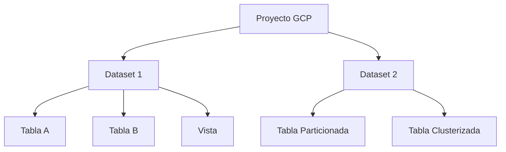

# 🔍 Google BigQuery - Ayuda Memoria para Ingenieros de Datos

## 1. 🧠 Arquitectura y Conceptos



| Concepto | Descripción |
| :--- | :--- |
| **Proyecto** | Unidad de facturación y organización en GCP |
| **Dataset** | Contenedor de tablas (similar a schema) |
| **Slot** | Unidad de cómputo. Se asignan automáticamente o se reservan |
| **Tabla Particionada** | Dividida por columna (fecha, entero, ingesta) |
| **Tabla Clusterizada** | Ordenada físicamente por hasta 4 columnas |
| **Vista Materializada** | Vista pre-calculada, se actualiza automáticamente |
| **Tabla Externa** | Datos en GCS consultados desde BigQuery |

> [!IMPORTANT] Modelo de Costos
> BigQuery cobra por **datos escaneados** (queries) y **almacenamiento**. Usar particiones y clustering reduce costos drásticamente.

---

## 2. 📋 SQL Específico de BigQuery

### DDL (Definición de Datos)
```sql
-- Crear dataset
CREATE SCHEMA IF NOT EXISTS `proyecto.mi_dataset`
OPTIONS (location = 'US');

-- Crear tabla particionada y clusterizada
CREATE TABLE `proyecto.mi_dataset.ventas` (
    id INT64,
    fecha DATE,
    cliente_id INT64,
    producto STRING,
    monto FLOAT64,
    region STRING
)
PARTITION BY fecha
CLUSTER BY region, producto
OPTIONS (
    description = 'Tabla de ventas diarias',
    partition_expiration_days = 365
);

-- Crear tabla desde query
CREATE TABLE `proyecto.dataset.resumen` AS
SELECT region, SUM(monto) AS total
FROM `proyecto.dataset.ventas`
GROUP BY region;

-- Vista materializada
CREATE MATERIALIZED VIEW `proyecto.dataset.mv_ventas_diarias` AS
SELECT fecha, region, SUM(monto) AS total_diario, COUNT(*) AS transacciones
FROM `proyecto.dataset.ventas`
GROUP BY fecha, region;
```

### Consultas Optimizadas
```sql
-- SIEMPRE filtrar por la columna de partición
SELECT * FROM `proyecto.dataset.ventas`
WHERE fecha BETWEEN '2026-01-01' AND '2026-01-31'  -- Reduce costo
AND region = 'LATAM';                               -- Aprovecha clustering

-- Ver cuántos bytes escaneará la query (dry run)
-- En bq CLI: bq query --dry_run "SELECT ..."

-- Estimar costo antes de ejecutar
SELECT 
    total_bytes_processed / POW(1024, 4) AS TB_escaneados,
    (total_bytes_processed / POW(1024, 4)) * 6.25 AS costo_usd  -- $6.25/TB
FROM `region-us`.INFORMATION_SCHEMA.JOBS
WHERE job_id = 'tu_job_id';
```

---

## 3. 📥 Carga de Datos

### Desde GCS (Cloud Storage)
```sql
-- Cargar CSV
LOAD DATA INTO `proyecto.dataset.tabla`
FROM FILES (
    format = 'CSV',
    uris = ['gs://mi-bucket/datos/*.csv'],
    skip_leading_rows = 1
);

-- Cargar Parquet
LOAD DATA INTO `proyecto.dataset.tabla`
FROM FILES (
    format = 'PARQUET',
    uris = ['gs://mi-bucket/datos/*.parquet']
);

-- Tabla externa (no carga, consulta directo de GCS)
CREATE EXTERNAL TABLE `proyecto.dataset.externa`
OPTIONS (
    format = 'PARQUET',
    uris = ['gs://mi-bucket/datos/*.parquet']
);
```

### bq CLI
```bash
# Cargar archivo local
bq load --source_format=CSV \
  --skip_leading_rows=1 \
  proyecto:dataset.tabla \
  datos.csv \
  id:INTEGER,nombre:STRING,fecha:DATE

# Cargar desde GCS
bq load --source_format=PARQUET \
  proyecto:dataset.tabla \
  gs://mi-bucket/datos/*.parquet

# Exportar a GCS
bq extract --destination_format=PARQUET \
  proyecto:dataset.tabla \
  gs://mi-bucket/export/datos-*.parquet
```

---

## 4. 🔧 Funciones Avanzadas

### STRUCT y ARRAY (Datos Anidados)
```sql
-- Crear tabla con datos anidados
CREATE TABLE `proyecto.dataset.pedidos` (
    pedido_id INT64,
    cliente STRUCT<nombre STRING, email STRING>,
    items ARRAY<STRUCT<producto STRING, cantidad INT64, precio FLOAT64>>
);

-- Consultar datos anidados
SELECT 
    pedido_id,
    cliente.nombre,
    item.producto,
    item.cantidad * item.precio AS subtotal
FROM `proyecto.dataset.pedidos`,
UNNEST(items) AS item;
```

### Scripting y Procedimientos
```sql
-- Variables y loops
DECLARE fecha_inicio DATE DEFAULT '2026-01-01';
DECLARE fecha_fin DATE DEFAULT CURRENT_DATE();

BEGIN
    WHILE fecha_inicio < fecha_fin DO
        INSERT INTO resumen_diario
        SELECT fecha_inicio, COUNT(*), SUM(monto)
        FROM ventas WHERE fecha = fecha_inicio;
        
        SET fecha_inicio = DATE_ADD(fecha_inicio, INTERVAL 1 DAY);
    END WHILE;
END;

-- Procedimiento almacenado
CREATE PROCEDURE `proyecto.dataset.procesar_ventas`(fecha DATE)
BEGIN
    DELETE FROM resumen WHERE fecha_proceso = fecha;
    INSERT INTO resumen
    SELECT fecha, region, SUM(monto) 
    FROM ventas WHERE fecha_venta = fecha
    GROUP BY region;
END;

CALL `proyecto.dataset.procesar_ventas`('2026-02-01');
```

### Scheduled Queries (Queries Programadas)
```sql
-- Se configuran desde la consola o con Terraform
-- Ejemplo de query programada:
INSERT INTO `proyecto.dataset.resumen_diario`
SELECT 
    CURRENT_DATE() AS fecha,
    region,
    COUNT(*) AS transacciones,
    SUM(monto) AS total
FROM `proyecto.dataset.ventas`
WHERE fecha = DATE_SUB(CURRENT_DATE(), INTERVAL 1 DAY)
GROUP BY region;
```

---

## 5. 🐍 BigQuery con Python

```python
from google.cloud import bigquery

client = bigquery.Client(project='mi-proyecto')

# Ejecutar query
query = """
    SELECT region, SUM(monto) AS total
    FROM `proyecto.dataset.ventas`
    WHERE fecha > '2026-01-01'
    GROUP BY region
"""
df = client.query(query).to_dataframe()

# Cargar DataFrame a BigQuery
from google.cloud.bigquery import LoadJobConfig, WriteDisposition

job_config = LoadJobConfig(
    write_disposition=WriteDisposition.WRITE_TRUNCATE,  # Reemplazar
    # write_disposition=WriteDisposition.WRITE_APPEND,  # Agregar
)

job = client.load_table_from_dataframe(
    df, 'proyecto.dataset.tabla_destino', job_config=job_config
)
job.result()  # Esperar a que termine
print(f"Cargadas {job.output_rows} filas")
```

---

## 6. 💰 Optimización de Costos

| Estrategia | Ahorro Estimado |
| :--- | :--- |
| Particionar por fecha | Hasta 90% |
| Clustering | Hasta 50% adicional |
| `SELECT` solo columnas necesarias | Variable (evitar `SELECT *`) |
| Vistas materializadas | Evita re-cálculos |
| Cuotas por proyecto/usuario | Previene gastos inesperados |
| Flat-rate pricing | Predecible para alto volumen |

```sql
-- Ver consumo de los últimos 30 días
SELECT 
    user_email,
    COUNT(*) AS total_queries,
    SUM(total_bytes_processed) / POW(1024, 4) AS TB_total,
    SUM(total_bytes_processed) / POW(1024, 4) * 6.25 AS costo_usd
FROM `region-us`.INFORMATION_SCHEMA.JOBS
WHERE creation_time > TIMESTAMP_SUB(CURRENT_TIMESTAMP(), INTERVAL 30 DAY)
GROUP BY user_email
ORDER BY TB_total DESC;
```

---

## 🧭 Navegación

Vuelve al [[Índice Data Engineering|Índice]]
Relacionado: [[Snowflake|Snowflake]] | [[SQL Cheatsheet|SQL Cheatsheet]]
