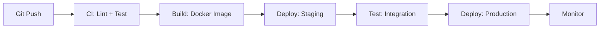

# 🚀 CI/CD para Pipelines de Datos - Ayuda Memoria

## 1. 🧠 Flujo CI/CD para Data



---

## 2. 🧪 GitHub Actions para Data Pipelines

### Pipeline SQL (dbt)
```yaml
# .github/workflows/dbt_ci.yml
name: dbt CI/CD

on:
  pull_request:
    paths: ['dbt/**']
  push:
    branches: [main]

jobs:
  test:
    runs-on: ubuntu-latest
    steps:
      - uses: actions/checkout@v4
      
      - name: Setup Python
        uses: actions/setup-python@v5
        with:
          python-version: '3.11'
      
      - name: Install dbt
        run: pip install dbt-postgres dbt-utils
      
      - name: dbt deps
        run: cd dbt && dbt deps
      
      - name: dbt build (compile + run + test)
        run: cd dbt && dbt build --target staging
        env:
          DBT_PROFILES_DIR: ./dbt
          DB_HOST: ${{ secrets.STAGING_DB_HOST }}
          DB_PASSWORD: ${{ secrets.STAGING_DB_PASSWORD }}
      
      - name: dbt docs generate
        run: cd dbt && dbt docs generate
      
      - name: Upload docs
        uses: actions/upload-artifact@v4
        with:
          name: dbt-docs
          path: dbt/target/

  deploy:
    needs: test
    if: github.ref == 'refs/heads/main'
    runs-on: ubuntu-latest
    steps:
      - uses: actions/checkout@v4
      
      - name: Deploy to Production
        run: cd dbt && dbt run --target production
        env:
          DB_HOST: ${{ secrets.PROD_DB_HOST }}
          DB_PASSWORD: ${{ secrets.PROD_DB_PASSWORD }}
```

### Pipeline Python (Spark/ETL)
```yaml
# .github/workflows/etl_ci.yml
name: ETL CI/CD

on:
  pull_request:
    paths: ['src/**', 'tests/**']
  push:
    branches: [main]

jobs:
  lint-and-test:
    runs-on: ubuntu-latest
    steps:
      - uses: actions/checkout@v4
      
      - name: Setup Python
        uses: actions/setup-python@v5
        with:
          python-version: '3.11'
      
      - name: Install dependencies
        run: pip install -r requirements.txt -r requirements-dev.txt
      
      - name: Lint (ruff)
        run: ruff check src/
      
      - name: Format check (black)
        run: black --check src/
      
      - name: Type check (mypy)
        run: mypy src/
      
      - name: Unit tests
        run: pytest tests/unit/ -v --cov=src --cov-report=xml
      
      - name: Integration tests
        run: pytest tests/integration/ -v
        env:
          TEST_DB_URL: ${{ secrets.TEST_DB_URL }}

  build-and-push:
    needs: lint-and-test
    if: github.ref == 'refs/heads/main'
    runs-on: ubuntu-latest
    steps:
      - uses: actions/checkout@v4
      
      - name: Build Docker image
        run: docker build -t mi-pipeline:${{ github.sha }} .
      
      - name: Push to registry
        run: |
          docker tag mi-pipeline:${{ github.sha }} registry.example.com/mi-pipeline:latest
          docker push registry.example.com/mi-pipeline:latest
```

---

## 3. 🧪 Testing de Datos

### Unit Tests para Transformaciones
```python
# tests/unit/test_transformaciones.py
import pytest
import pandas as pd
from src.transformaciones import limpiar_ventas, calcular_kpis

def test_limpiar_ventas_elimina_nulos():
    df = pd.DataFrame({
        'id': [1, 2, 3],
        'monto': [100, None, 300],
        'fecha': ['2026-01-01', '2026-01-02', None]
    })
    resultado = limpiar_ventas(df)
    assert resultado['monto'].isnull().sum() == 0
    assert len(resultado) == 1  # Solo fila 1 sobrevive

def test_limpiar_ventas_rechaza_negativos():
    df = pd.DataFrame({
        'id': [1, 2],
        'monto': [100, -50],
        'fecha': ['2026-01-01', '2026-01-02']
    })
    resultado = limpiar_ventas(df)
    assert (resultado['monto'] >= 0).all()

def test_calcular_kpis():
    df = pd.DataFrame({
        'region': ['A', 'A', 'B'],
        'monto': [100, 200, 300]
    })
    kpis = calcular_kpis(df)
    assert kpis.loc[kpis['region'] == 'A', 'total'].values[0] == 300
    assert kpis.loc[kpis['region'] == 'B', 'total'].values[0] == 300
```

### Contract Tests (Schema)
```python
# tests/contract/test_schema.py
def test_schema_ventas():
    """Verificar que el schema no cambió inesperadamente."""
    schema_esperado = {
        'venta_id': 'int64',
        'fecha': 'datetime64[ns]',
        'monto': 'float64',
        'cliente_id': 'int64',
        'producto': 'object',
    }
    
    df = pd.read_parquet('output/ventas.parquet')
    schema_actual = df.dtypes.to_dict()
    
    for col, dtype in schema_esperado.items():
        assert col in schema_actual, f"Columna '{col}' faltante"
        assert str(schema_actual[col]) == dtype, f"Tipo incorrecto en '{col}'"
```

---

## 4. 🐳 Dockerfile para Pipelines

```dockerfile
FROM python:3.11-slim

WORKDIR /app

COPY requirements.txt .
RUN pip install --no-cache-dir -r requirements.txt

COPY src/ ./src/
COPY config/ ./config/

# No correr como root
RUN useradd -m appuser
USER appuser

ENTRYPOINT ["python", "-m", "src.main"]
```

---

## 5. 📋 Pre-commit Hooks

```yaml
# .pre-commit-config.yaml
repos:
  - repo: https://github.com/astral-sh/ruff-pre-commit
    rev: v0.3.0
    hooks:
      - id: ruff
        args: [--fix]
      - id: ruff-format

  - repo: https://github.com/pre-commit/pre-commit-hooks
    rev: v4.5.0
    hooks:
      - id: trailing-whitespace
      - id: end-of-file-fixer
      - id: check-yaml
      - id: check-json
      - id: detect-private-key    # Evitar subir secretos
      - id: no-commit-to-branch
        args: ['--branch', 'main']

  - repo: https://github.com/sqlfluff/sqlfluff
    rev: 3.0.0
    hooks:
      - id: sqlfluff-lint
        args: [--dialect, postgres]
```

```bash
# Instalar
pip install pre-commit
pre-commit install
pre-commit run --all-files
```

---

## 🧭 Navegación

Vuelve al [[Índice Data Engineering|Índice]]
Relacionado: [[Comandos Cloud y CLI|Cloud CLI]] | [[Terraform para Data|Terraform]] | [[Observabilidad de Datos|Observabilidad]]
