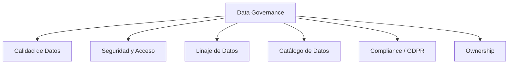
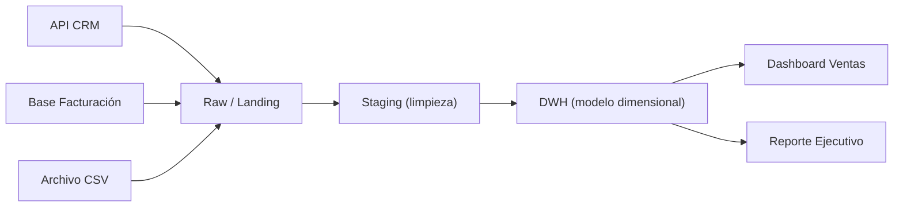

# 🛡️ Data Governance - Ayuda Memoria para Ingenieros de Datos

## 1. 🧠 Pilares del Data Governance



| Pilar | Descripción | Herramientas |
| :--- | :--- | :--- |
| **Calidad** | Datos correctos, completos, consistentes | Great Expectations, Soda, dbt tests |
| **Seguridad** | Quién accede a qué datos | IAM, RBAC, Column masking |
| **Linaje** | De dónde vienen y a dónde van los datos | OpenLineage, Marquez, Atlas |
| **Catálogo** | Inventario de todos los datos | DataHub, Amundsen, Unity Catalog |
| **Compliance** | Cumplir normativas (GDPR, CCPA, HIPAA) | Políticas de retención, PII |
| **Ownership** | Quién es responsable de cada dataset | Data Stewards, RACI matrix |

---

## 2. 📊 Dimensiones de Calidad de Datos

| Dimensión | Descripción | Ejemplo de Validación |
| :--- | :--- | :--- |
| **Completitud** | Sin valores faltantes críticos | `email IS NOT NULL` |
| **Unicidad** | Sin duplicados | `COUNT(DISTINCT id) = COUNT(*)` |
| **Validez** | Valores dentro de rangos aceptados | `edad BETWEEN 0 AND 150` |
| **Consistencia** | Coherente entre sistemas | Total ventas = sum(líneas) |
| **Oportunidad** | Datos disponibles a tiempo | Carga completada antes de las 8 AM |
| **Exactitud** | Datos reflejan la realidad | Validación cruzada con fuente |

### Data Quality con SQL
```sql
-- Reporte de calidad automatizado
WITH calidad AS (
    SELECT
        COUNT(*) AS total_registros,
        COUNT(*) - COUNT(email) AS nulos_email,
        COUNT(*) - COUNT(DISTINCT id) AS duplicados,
        COUNT(CASE WHEN monto < 0 THEN 1 END) AS montos_negativos,
        COUNT(CASE WHEN fecha > CURRENT_DATE THEN 1 END) AS fechas_futuras,
        COUNT(CASE WHEN NOT email ~ '^[A-Za-z0-9.]+@[A-Za-z0-9.]+$' THEN 1 END) AS emails_invalidos
    FROM ventas
    WHERE fecha = CURRENT_DATE - INTERVAL '1 day'
)
SELECT 
    total_registros,
    ROUND(nulos_email::NUMERIC / total_registros * 100, 2) AS pct_nulos_email,
    ROUND(duplicados::NUMERIC / total_registros * 100, 2) AS pct_duplicados,
    montos_negativos,
    fechas_futuras,
    emails_invalidos
FROM calidad;
```

---

## 3. 🔒 Seguridad y Control de Acceso

### RBAC (Role-Based Access Control)
```sql
-- PostgreSQL / Snowflake
CREATE ROLE data_analyst;
CREATE ROLE data_engineer;
CREATE ROLE data_admin;

-- Permisos por rol
GRANT SELECT ON ALL TABLES IN SCHEMA produccion TO data_analyst;
GRANT ALL PRIVILEGES ON SCHEMA staging TO data_engineer;
GRANT ALL PRIVILEGES ON DATABASE analytics TO data_admin;

-- Asignar roles a usuarios
GRANT data_analyst TO usuario_maria;
GRANT data_engineer TO usuario_carlos;
```

### Enmascaramiento de Datos (Column Masking)
```sql
-- Snowflake: Dynamic Data Masking
CREATE MASKING POLICY mascara_email AS (val STRING) RETURNS STRING ->
    CASE 
        WHEN CURRENT_ROLE() IN ('DATA_ADMIN') THEN val
        ELSE REGEXP_REPLACE(val, '.+@', '****@')
    END;

ALTER TABLE clientes MODIFY COLUMN email SET MASKING POLICY mascara_email;

-- BigQuery: Column-level security
-- Se configura mediante Data Catalog + IAM policies
```

### Row-Level Security (RLS)
```sql
-- Snowflake: cada usuario solo ve su región
CREATE ROW ACCESS POLICY filtro_region AS (region STRING) RETURNS BOOLEAN ->
    CASE
        WHEN CURRENT_ROLE() = 'DATA_ADMIN' THEN TRUE
        ELSE region = CURRENT_USER()
    END;

ALTER TABLE ventas ADD ROW ACCESS POLICY filtro_region ON (region);
```

---

## 4. 🔗 Linaje de Datos (Data Lineage)



### OpenLineage (Estándar Abierto)
```json
{
  "eventType": "COMPLETE",
  "eventTime": "2026-02-12T06:00:00Z",
  "job": {
    "namespace": "produccion",
    "name": "etl_ventas_diario"
  },
  "inputs": [
    {"namespace": "raw", "name": "ventas_crudo"}
  ],
  "outputs": [
    {"namespace": "produccion", "name": "fact_ventas"}
  ]
}
```

---

## 5. 📋 Compliance y PII

### Clasificación de Datos

| Nivel | Tipo | Ejemplos | Protección |
| :--- | :--- | :--- | :--- |
| 🔴 **Restringido** | PII Sensible | SSN, tarjeta crédito, salud | Encriptación + masking |
| 🟠 **Confidencial** | PII | Email, teléfono, dirección | Masking por rol |
| 🟡 **Interno** | Datos de negocio | Ventas, métricas | Acceso por equipo |
| 🟢 **Público** | Datos abiertos | Catálogo productos | Sin restricción |

### GDPR / CCPA Checklist
- [ ] Inventario de datos personales (Data Mapping)
- [ ] Consentimiento documentado
- [ ] Derecho al olvido implementado (`DELETE WHERE usuario_id = X`)
- [ ] Retención de datos definida (auto-eliminación)
- [ ] Registro de accesos a datos sensibles (audit log)
- [ ] DPA (Data Processing Agreement) con terceros
- [ ] Notificación de brechas en 72 horas

---

## 6. 📚 Catálogo de Datos

> [!TIP] Consejo
> Un buen catálogo de datos permite que cualquier persona en la empresa encuentre, entienda y confíe en los datos.

### Metadata esencial para cada tabla

| Campo | Ejemplo |
| :--- | :--- |
| **Nombre** | `produccion.fact_ventas` |
| **Descripción** | Tabla de hechos con ventas diarias |
| **Owner** | equipo-data-engineering |
| **Frecuencia** | Diaria, 6:00 AM UTC |
| **Fuente** | API CRM + Base facturación |
| **SLA** | Disponible antes de 8:00 AM |
| **Retención** | 3 años |
| **Clasificación** | Confidencial |
| **Columnas PII** | email, telefono |
| **Última actualización** | 2026-02-12 06:15:00 |

---

## 🧭 Navegación

Vuelve al [[Índice Data Engineering|Índice]]
Relacionado: [[Data Modeling|Modelado]] | [[Observabilidad de Datos|Observabilidad]] | [[Data Mesh|Data Mesh]]
