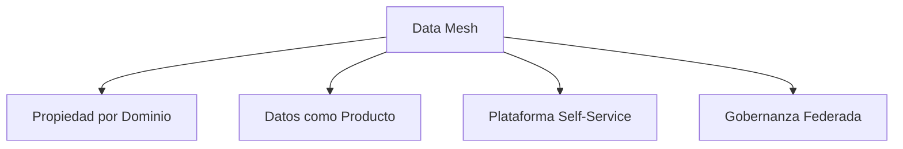
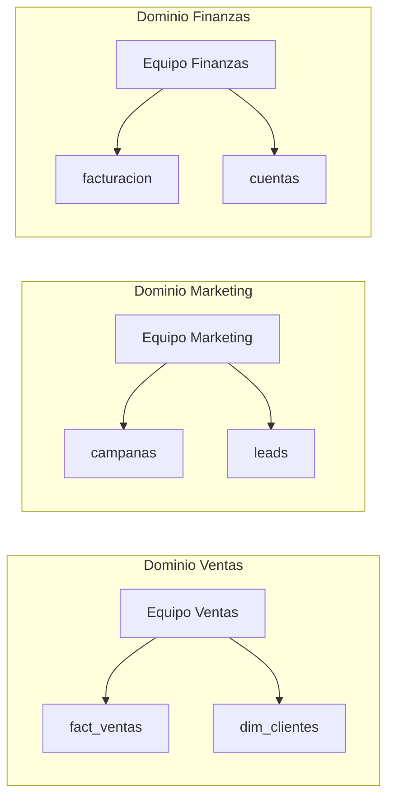
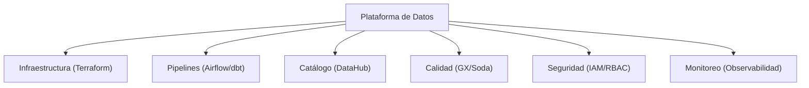

# 🕸️ Data Mesh - Ayuda Memoria para Ingenieros de Datos

## 1. 🧠 ¿Qué es Data Mesh?

> [!NOTE] Definición
> Data Mesh es un paradigma organizacional y arquitectónico que trata los **datos como producto**, con propiedad descentralizada por dominios de negocio, sobre una plataforma de datos self-service.



---

## 2. 🏛️ 4 Principios Fundamentales

### 1. Propiedad por Dominio


| Principio | Descripción |
| :--- | :--- |
| **Propiedad por Dominio** | Cada equipo de negocio es dueño de sus datos |
| **Datos como Producto** | Los datos tienen SLAs, documentación, calidad garantizada |
| **Plataforma Self-Service** | Infraestructura centralizada, uso descentralizado |
| **Gobernanza Computacional Federada** | Políticas globales aplicadas automáticamente |

### 2. Datos como Producto
Un "Data Product" debe cumplir:
- [ ] **Descubrible**: Registrado en catálogo, fácil de encontrar
- [ ] **Comprensible**: Documentación clara, schema, descripción
- [ ] **Confiable**: SLAs definidos, calidad validada
- [ ] **Oportuno**: Datos entregados a tiempo
- [ ] **Interoperable**: Formatos estándar, compatible con otros dominios
- [ ] **Seguro**: Control de acceso, PII protegida
- [ ] **Autodescriptivo**: Metadata rica

### 3. Plataforma Self-Service


### 4. Gobernanza Federada
```yaml
# Política global aplicada automáticamente
politica_global:
  naming_convention:
    tablas: "{dominio}.{capa}.{entidad}"
    columnas: snake_case
  
  calidad_minima:
    completitud: 99%
    unicidad_pk: 100%
    frescura: < 24h
  
  seguridad:
    pii_masking: obligatorio
    audit_log: habilitado
    retention: 3_years
```

---

## 3. 📦 Estructura de un Data Product

```
dominio-ventas/
├── README.md              # Documentación del producto
├── schema/
│   └── ventas.yaml        # Schema del data product
├── quality/
│   └── expectations.yaml  # Validaciones de calidad
├── pipelines/
│   ├── ingest.py          # Pipeline de ingesta
│   └── transform.sql      # Transformaciones
├── sla.yaml               # Service Level Agreement
└── access/
    └── permissions.yaml   # Permisos de acceso
```

### SLA de un Data Product
```yaml
# sla.yaml
data_product: ventas_diarias
domain: ventas
owner: equipo-ventas@empresa.com
tier: Tier 1 (Critical)

freshness:
  max_delay: 2 hours
  schedule: "Daily at 06:00 UTC"

quality:
  completeness: ">= 99.5%"
  uniqueness: "100% on venta_id"
  validity: "monto > 0"

availability: "99.9%"
support: "#canal-datos-ventas"
```

---

## 4. 🆚 Data Mesh vs Tradicional

| Aspecto | Centralizado | Data Mesh |
| :--- | :--- | :--- |
| **Propiedad** | Equipo central de datos | Equipos de dominio |
| **Bottleneck** | Equipo central | Eliminado |
| **Conocimiento** | Generalistas | Expertos del dominio |
| **Escalabilidad** | Limitada por equipo central | Escala con la organización |
| **Gobernanza** | Centralizada | Federada |
| **Riesgo** | Single point of failure | Distribuido |

---

## 5. ⚠️ Cuándo NO usar Data Mesh

> [!WARNING] No siempre es la respuesta
> - Organizaciones pequeñas (< 50 personas en datos)
> - Sin madurez en ingeniería de datos
> - Sin cultura de ownership
> - Si funciona un equipo central eficiente

---

## 🧭 Navegación

Vuelve al [[Índice Data Engineering|Índice]]
Relacionado: [[Data Governance|Governance]] | [[Arquitectura Medallion|Medallion]] | [[Data Modeling|Modelado]]
