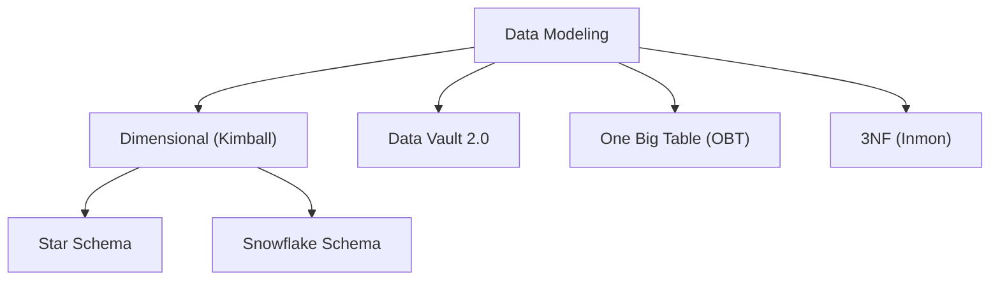
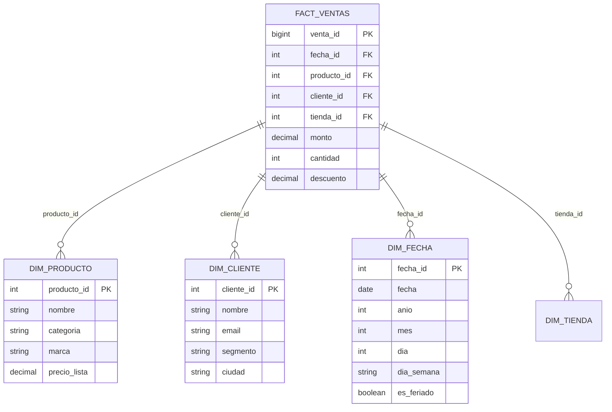
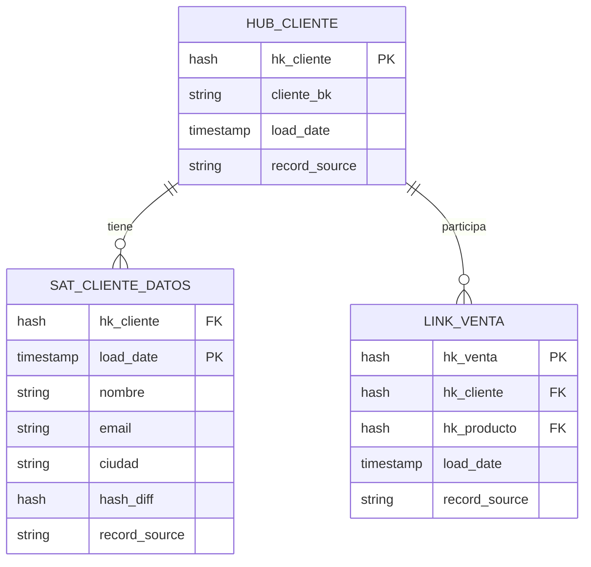

# 📐 Data Modeling - Ayuda Memoria para Ingenieros de Datos

## 1. 🧠 Paradigmas de Modelado



| Paradigma | Cuándo Usar | Ventajas | Desventajas |
| :--- | :--- | :--- | :--- |
| **Star Schema** | BI tradicional, dashboards | Simple, rápido en queries | Redundancia controlada |
| **Snowflake Schema** | Datos normalizados | Menos redundancia | JOINs más complejos |
| **Data Vault 2.0** | Data Warehouse empresarial | Auditable, escalable, histórico | Mayor complejidad |
| **OBT** | Analytics moderno, herramientas cloud | Ultra-simple, sin JOINs | Tabla muy ancha |
| **3NF** | Sistemas transaccionales (OLTP) | Sin redundancia | Muchos JOINs |

---

## 2. ⭐ Star Schema (Kimball)



### Tabla de Hechos (Facts)
```sql
CREATE TABLE fact_ventas (
    venta_id     BIGINT PRIMARY KEY,
    fecha_id     INT REFERENCES dim_fecha(fecha_id),
    producto_id  INT REFERENCES dim_producto(producto_id),
    cliente_id   INT REFERENCES dim_cliente(cliente_id),
    tienda_id    INT REFERENCES dim_tienda(tienda_id),
    -- Métricas (lo que mides)
    cantidad     INT,
    monto        DECIMAL(12,2),
    costo        DECIMAL(12,2),
    descuento    DECIMAL(12,2)
);
```

### Dimensión de Fecha (siempre crear una)
```sql
CREATE TABLE dim_fecha AS
SELECT 
    TO_CHAR(fecha, 'YYYYMMDD')::INT AS fecha_id,
    fecha,
    EXTRACT(YEAR FROM fecha) AS anio,
    EXTRACT(QUARTER FROM fecha) AS trimestre,
    EXTRACT(MONTH FROM fecha) AS mes,
    TO_CHAR(fecha, 'Month') AS nombre_mes,
    EXTRACT(DOW FROM fecha) AS dia_semana,
    TO_CHAR(fecha, 'Day') AS nombre_dia,
    CASE WHEN EXTRACT(DOW FROM fecha) IN (0, 6) THEN TRUE ELSE FALSE END AS es_fin_semana
FROM generate_series('2020-01-01'::date, '2030-12-31'::date, '1 day') AS fecha;
```

---

## 3. 🔄 Slowly Changing Dimensions (SCD)

| Tipo | Qué hace | Ejemplo |
| :--- | :--- | :--- |
| **SCD 0** | Nunca cambia | Fecha de nacimiento |
| **SCD 1** | Sobrescribe (sin historial) | Corrección de errores |
| **SCD 2** | Nueva fila con vigencia | Cambio de dirección del cliente |
| **SCD 3** | Columna anterior + actual | Valor previo y actual |

### SCD Tipo 2 (el más común)
```sql
-- Estructura de tabla SCD-2
CREATE TABLE dim_cliente (
    sk_cliente     BIGINT PRIMARY KEY,  -- Surrogate Key
    cliente_id     INT,                  -- Natural Key
    nombre         STRING,
    email          STRING,
    ciudad         STRING,
    segmento       STRING,
    -- Campos de control SCD-2
    fecha_inicio   DATE,
    fecha_fin      DATE,                 -- NULL = registro activo
    es_actual      BOOLEAN,
    version        INT
);

-- Merge SCD-2 en Spark SQL / Delta Lake
MERGE INTO dim_cliente AS target
USING nuevos_clientes AS source
ON target.cliente_id = source.cliente_id AND target.es_actual = TRUE

-- Si el registro cambió, cerrar el viejo
WHEN MATCHED AND (target.ciudad != source.ciudad OR target.segmento != source.segmento) THEN
    UPDATE SET fecha_fin = CURRENT_DATE, es_actual = FALSE

-- Insertar nuevas versiones
WHEN NOT MATCHED THEN
    INSERT (cliente_id, nombre, email, ciudad, segmento, fecha_inicio, fecha_fin, es_actual, version)
    VALUES (source.cliente_id, source.nombre, source.email, source.ciudad, source.segmento, CURRENT_DATE, NULL, TRUE, 1);
```

---

## 4. 🏛️ Data Vault 2.0



| Componente | Descripción |
| :--- | :--- |
| **Hub** | Business keys únicas (cliente_id, producto_id) |
| **Link** | Relaciones entre Hubs (venta conecta cliente y producto) |
| **Satellite** | Atributos descriptivos con historial completo |

---

## 5. 📏 Convenciones de Naming

| Capa | Prefijo | Ejemplo |
| :--- | :--- | :--- |
| **Staging** | `stg_` | `stg_ventas`, `stg_clientes` |
| **Intermedia** | `int_` | `int_ventas_limpias` |
| **Dimensiones** | `dim_` | `dim_cliente`, `dim_fecha` |
| **Hechos** | `fact_` o `fct_` | `fact_ventas`, `fct_ordenes` |
| **Métricas** | `met_` | `met_kpi_ventas` |
| **Snapshots** | `snap_` | `snap_inventario_diario` |

---

## 🧭 Navegación

Vuelve al [[Índice Data Engineering|Índice]]
Relacionado: [[SQL Cheatsheet|SQL]] | [[Arquitectura Medallion|Medallion]] | [[Data Governance|Governance]]
