# 🧱 Databricks - Ayuda Memoria para Ingenieros de Datos

## 1. 🧠 Arquitectura

```mermaid
graph TD
    A["Databricks Workspace"] --> B["Unity Catalog"]
    A --> C["Clusters"]
    A --> D["Notebooks"]
    A --> E["Jobs"]
    B --> F["Catálogo > Schema > Tabla"]
    C --> G["All-Purpose (interactivo)"]
    C --> H["Job Clusters (automatizado)"]
```



| Concepto | Descripción |
| :--- | :--- |
| **Workspace** | Entorno colaborativo con notebooks, repos, jobs |
| **Unity Catalog** | Gobierno centralizado de datos (permisos, linaje) |
| **Cluster** | Grupo de VMs para procesar datos con Spark |
| **Notebook** | Editor interactivo (Python, SQL, Scala, R) |
| **Job** | Ejecución programada de notebooks o scripts |
| **Delta Lake** | Formato de tabla por defecto en Databricks |
| **DBFS** | Sistema de archivos distribuido de Databricks |
| **Photon** | Motor de ejecución nativo C++ (más rápido que Spark) |

---

## 2. 📋 SQL en Databricks

```sql
-- Crear catálogo y schema (Unity Catalog)
CREATE CATALOG IF NOT EXISTS analytics;
CREATE SCHEMA IF NOT EXISTS analytics.produccion;

-- Crear tabla Delta
CREATE TABLE analytics.produccion.ventas (
    id BIGINT GENERATED ALWAYS AS IDENTITY,
    fecha DATE,
    producto STRING,
    monto DOUBLE,
    region STRING
)
PARTITIONED BY (fecha)
COMMENT 'Tabla de ventas diarias';

-- MERGE (Upsert)
MERGE INTO analytics.produccion.ventas AS target
USING staging.nuevas_ventas AS source
ON target.id = source.id
WHEN MATCHED THEN UPDATE SET *
WHEN NOT MATCHED THEN INSERT *;

-- OPTIMIZE (compactación de archivos pequeños)
OPTIMIZE analytics.produccion.ventas;
OPTIMIZE analytics.produccion.ventas ZORDER BY (region, producto);

-- VACUUM (eliminar archivos antiguos)
VACUUM analytics.produccion.ventas RETAIN 168 HOURS;

-- Historial de cambios
DESCRIBE HISTORY analytics.produccion.ventas;

-- Time Travel
SELECT * FROM analytics.produccion.ventas VERSION AS OF 5;
SELECT * FROM analytics.produccion.ventas TIMESTAMP AS OF '2026-02-01';

-- Restaurar versión anterior
RESTORE TABLE analytics.produccion.ventas TO VERSION AS OF 3;
```

---

## 3. 🐍 PySpark en Databricks

```python
# Leer tabla Delta
df = spark.table("analytics.produccion.ventas")

# Leer desde almacenamiento externo
df = spark.read.format("parquet").load("s3://bucket/datos/")
df = spark.read.format("csv").option("header", True).load("dbfs:/datos/archivo.csv")

# Auto Loader (ingesta incremental automática)
df = spark.readStream \
    .format("cloudFiles") \
    .option("cloudFiles.format", "json") \
    .option("cloudFiles.schemaLocation", "/esquemas/ventas") \
    .option("cloudFiles.inferColumnTypes", True) \
    .load("s3://bucket/landing/ventas/")

# Escribir con streaming
df.writeStream \
    .format("delta") \
    .outputMode("append") \
    .option("checkpointLocation", "/checkpoints/ventas") \
    .trigger(availableNow=True) \
    .toTable("analytics.staging.ventas_raw")

# Widgets (parámetros interactivos)
dbutils.widgets.text("fecha", "2026-02-12", "Fecha de Procesamiento")
dbutils.widgets.dropdown("ambiente", "dev", ["dev", "staging", "prod"])
fecha = dbutils.widgets.get("fecha")
```

---

## 4. 🔄 Workflows y Jobs

```python
# dbutils para control de flujo
dbutils.notebook.run("/pipelines/extraer", timeout_seconds=3600, 
                      arguments={"fecha": "2026-02-12"})

# Encadenar notebooks
resultado = dbutils.notebook.run("/pipelines/validar", 600)
if resultado == "FALLO":
    dbutils.notebook.exit("Error en validación")

# Secrets (nunca hardcodear credenciales)
password = dbutils.secrets.get(scope="produccion", key="db_password")
api_key = dbutils.secrets.get(scope="produccion", key="api_key")
```

### Configuración de Job (JSON)
```json
{
  "name": "Pipeline Ventas Diario",
  "tasks": [
    {
      "task_key": "extraer",
      "notebook_task": {"notebook_path": "/pipelines/extraer"},
      "job_cluster_key": "cluster_etl"
    },
    {
      "task_key": "transformar",
      "depends_on": [{"task_key": "extraer"}],
      "notebook_task": {"notebook_path": "/pipelines/transformar"}
    },
    {
      "task_key": "cargar",
      "depends_on": [{"task_key": "transformar"}],
      "notebook_task": {"notebook_path": "/pipelines/cargar"}
    }
  ],
  "schedule": {
    "quartz_cron_expression": "0 0 6 * * ?",
    "timezone_id": "America/Santiago"
  }
}
```

---

## 5. 💰 Optimización de Costos

| Estrategia | Impacto |
| :--- | :--- |
| **Spot instances** | Ahorro 60-90% en clusters |
| **Auto-scaling** | Escalar workers según carga |
| **Auto-termination** | Apagar clusters inactivos |
| **Job clusters** | Más baratos que all-purpose |
| **Photon** | Más rápido = menos DBUs |
| **ZORDER** | Menos datos escaneados |
| **Caching** | `spark.catalog.cacheTable()` |

---

## 🧭 Navegación

Vuelve al [[Índice Data Engineering|Índice]]
Relacionado: [[Apache Spark|Spark]] | [[Apache Iceberg|Iceberg]] | [[Arquitectura Medallion|Medallion]]
