# 👁️ Observabilidad de Datos - Ayuda Memoria

## 1. 🧠 ¿Qué es?

> [!NOTE] Definición
> La observabilidad de datos es la capacidad de entender el estado de salud de tus datos mediante la detección automática de anomalías en frescura, volumen, schema, distribución y linaje.

```mermaid
graph TD
    A["Observabilidad de Datos"] --> B["Frescura"]
    A --> C["Volumen"]
    A --> D["Schema"]
    A --> E["Distribución"]
    A --> F["Linaje"]
```



| Pilar | Pregunta que responde | Ejemplo de anomalía |
| :--- | :--- | :--- |
| **Frescura** | ¿Los datos están actualizados? | Tabla no se actualizó hoy |
| **Volumen** | ¿Hay la cantidad esperada? | 50% menos filas que ayer |
| **Schema** | ¿La estructura cambió? | Columna eliminada sin aviso |
| **Distribución** | ¿Los valores son normales? | % de nulos pasó de 1% a 30% |
| **Linaje** | ¿De dónde vienen? ¿A quién afecta? | Tabla upstream quebrada |

---

## 2. 🧪 Great Expectations

```python
import great_expectations as gx

context = gx.get_context()

# Conectar a fuente de datos
datasource = context.sources.add_pandas("mi_fuente")
asset = datasource.add_dataframe_asset("ventas")

# Crear suite de expectativas
suite = context.add_expectation_suite("validaciones_ventas")

# Definir expectativas
suite.add_expectation(
    gx.expectations.ExpectColumnValuesToNotBeNull(column="venta_id")
)
suite.add_expectation(
    gx.expectations.ExpectColumnValuesToBeUnique(column="venta_id")
)
suite.add_expectation(
    gx.expectations.ExpectColumnValuesToBeBetween(
        column="monto", min_value=0, max_value=1000000
    )
)
suite.add_expectation(
    gx.expectations.ExpectTableRowCountToBeBetween(
        min_value=1000, max_value=100000
    )
)
suite.add_expectation(
    gx.expectations.ExpectColumnValuesToMatchRegex(
        column="email", regex=r"^[a-zA-Z0-9.]+@[a-zA-Z0-9.]+\.[a-zA-Z]{2,}$"
    )
)

# Ejecutar validación
results = context.run_checkpoint("mi_checkpoint")
if not results.success:
    raise Exception("¡Validación de datos fallida!")
```

---

## 3. 🥤 Soda Core

```yaml
# checks/ventas.yaml
checks for ventas:
  # Frescura
  - freshness(fecha) < 24h

  # Volumen
  - row_count between 1000 and 100000
  - row_count same as yesterday with tolerance 20%

  # Nulos
  - missing_count(venta_id) = 0
  - missing_percent(email) < 5%

  # Unicidad
  - duplicate_count(venta_id) = 0

  # Validez
  - invalid_count(monto) = 0:
      valid min: 0
  - invalid_percent(email) < 2%:
      valid regex: "^[a-zA-Z0-9.]+@.*$"

  # Distribución
  - avg(monto) between 50 and 500
  - stddev(monto) < 1000

  # Schema
  - schema:
      fail:
        when required column missing: [venta_id, fecha, monto]
        when wrong type:
          venta_id: integer
          monto: decimal
```

```bash
# Ejecutar checks
soda scan -d mi_db -c configuration.yml checks/ventas.yaml
```

---

## 4. 📋 dbt Tests

```yaml
# schema.yml
models:
  - name: fact_ventas
    description: "Tabla de hechos de ventas diarias"
    columns:
      - name: venta_id
        tests:
          - unique
          - not_null
      - name: monto
        tests:
          - not_null
          - dbt_utils.accepted_range:
              min_value: 0
              inclusive: true
      - name: fecha
        tests:
          - not_null
          - dbt_utils.expression_is_true:
              expression: "<= current_date"
      - name: cliente_id
        tests:
          - relationships:
              to: ref('dim_cliente')
              field: cliente_id
```

```sql
-- Test personalizado: tests/assert_positive_revenue.sql
SELECT fecha, SUM(monto) AS revenue_diario
FROM {{ ref('fact_ventas') }}
GROUP BY fecha
HAVING SUM(monto) < 0
```

---

## 5. 🔔 Sistema de Alertas

```python
# alertas.py - Enviar alertas cuando falla la calidad
import requests
from datetime import datetime

def enviar_alerta_slack(check_name, detalles, severidad="warning"):
    webhook_url = os.getenv("SLACK_WEBHOOK")
    
    emojis = {"critical": "🔴", "warning": "🟡", "info": "🔵"}
    
    payload = {
        "text": f"{emojis.get(severidad, '⚪')} *Alerta de Calidad de Datos*",
        "blocks": [
            {
                "type": "section",
                "text": {
                    "type": "mrkdwn",
                    "text": f"*Check:* `{check_name}`\n*Severidad:* {severidad}\n*Detalles:* {detalles}\n*Timestamp:* {datetime.now().isoformat()}"
                }
            }
        ]
    }
    requests.post(webhook_url, json=payload)
```

### Matriz de Severidad

| Severidad | Criterio | Acción |
| :--- | :--- | :--- |
| 🔴 **Crítica** | Pipeline roto, datos faltantes | Notificar inmediatamente, pausar downstream |
| 🟡 **Warning** | Anomalía en distribución, retraso | Notificar al equipo, investigar |
| 🔵 **Info** | Schema cambió, volumen inusual | Registrar, revisar en standup |

---

## 🧭 Navegación

Vuelve al [[Índice Data Engineering|Índice]]
Relacionado: [[Data Governance|Governance]] | [[ETL y Pipelines|ETL]] | [[Troubleshooting|Troubleshooting]]
