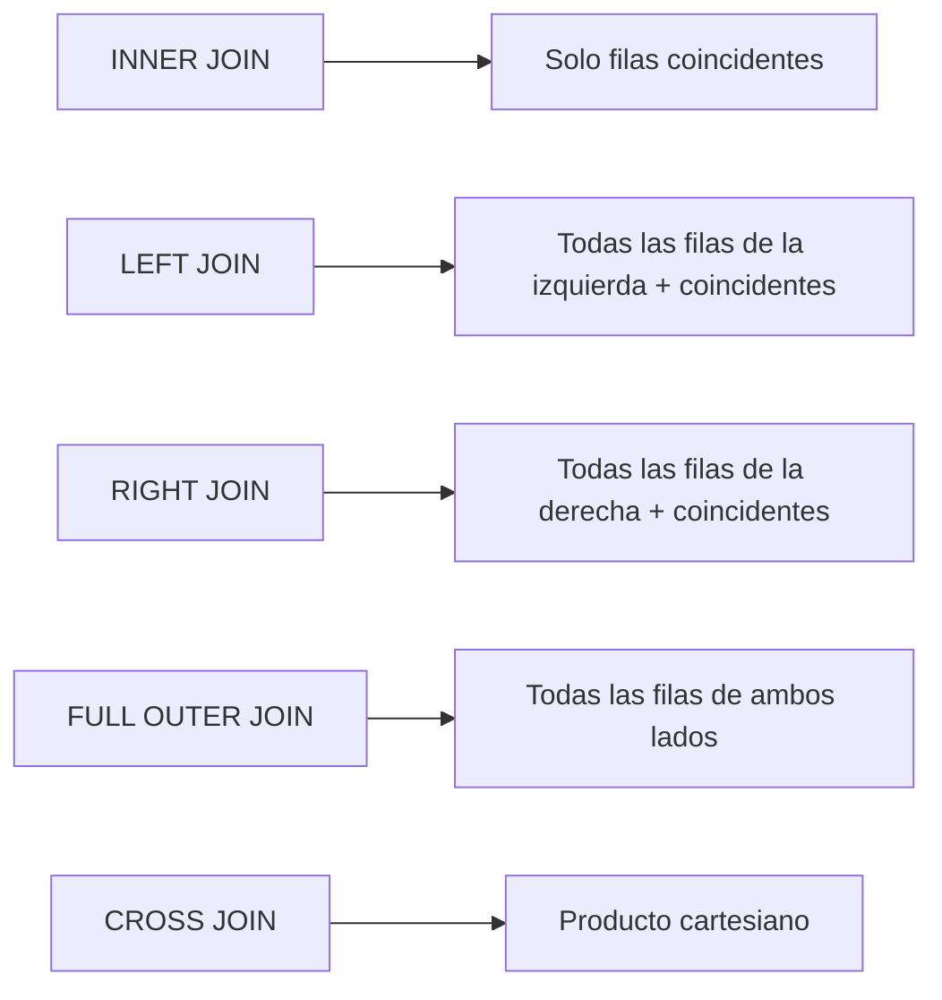

# 🗄️ SQL - Ayuda Memoria Maestra para Ingenieros de Datos

## 1. 📌 Consultas Básicas

```sql
-- Seleccionar todo
SELECT * FROM tabla;

-- Seleccionar columnas específicas con alias
SELECT nombre AS cliente, edad FROM clientes WHERE edad > 30;

-- Valores distintos
SELECT DISTINCT ciudad FROM clientes;

-- Ordenar resultados
SELECT * FROM ventas ORDER BY fecha DESC, monto ASC;

-- Limitar resultados
SELECT * FROM logs LIMIT 100 OFFSET 50;
```

---

## 2. 🔗 JOINs (Uniones)



```sql
-- INNER JOIN
SELECT o.id, c.nombre
FROM ordenes o
INNER JOIN clientes c ON o.cliente_id = c.id;

-- LEFT JOIN (mantiene todas las filas de la izquierda)
SELECT c.nombre, COALESCE(SUM(o.monto), 0) AS total
FROM clientes c
LEFT JOIN ordenes o ON c.id = o.cliente_id
GROUP BY c.nombre;

-- SELF JOIN (unir tabla consigo misma)
SELECT e.nombre AS empleado, m.nombre AS manager
FROM empleados e
LEFT JOIN empleados m ON e.manager_id = m.id;
```

---

## 3. 🪟 Window Functions (Funciones de Ventana)

> [!TIP] Consejo
> Las Window Functions son **indispensables** para un Ingeniero de Datos. Domínalas.

```sql
-- ROW_NUMBER: Numerar filas por grupo
SELECT nombre, departamento, salario,
       ROW_NUMBER() OVER (PARTITION BY departamento ORDER BY salario DESC) AS ranking
FROM empleados;

-- RANK y DENSE_RANK
SELECT nombre, salario,
       RANK() OVER (ORDER BY salario DESC) AS rank_con_huecos,
       DENSE_RANK() OVER (ORDER BY salario DESC) AS rank_sin_huecos
FROM empleados;

-- LAG / LEAD: Acceder a filas anteriores/siguientes
SELECT fecha, ventas,
       LAG(ventas, 1) OVER (ORDER BY fecha) AS ventas_dia_anterior,
       ventas - LAG(ventas, 1) OVER (ORDER BY fecha) AS diferencia
FROM ventas_diarias;

-- Running Total (Acumulado)
SELECT fecha, monto,
       SUM(monto) OVER (ORDER BY fecha ROWS UNBOUNDED PRECEDING) AS acumulado
FROM transacciones;

-- Moving Average (Promedio Móvil 7 días)
SELECT fecha, ventas,
       AVG(ventas) OVER (ORDER BY fecha ROWS BETWEEN 6 PRECEDING AND CURRENT ROW) AS promedio_7d
FROM ventas_diarias;
```

---

## 4. 📊 Agregaciones y GROUP BY

```sql
-- Agregaciones básicas
SELECT 
    departamento,
    COUNT(*) AS total_empleados,
    AVG(salario) AS salario_promedio,
    MIN(salario) AS salario_min,
    MAX(salario) AS salario_max,
    SUM(salario) AS nomina_total,
    PERCENTILE_CONT(0.5) WITHIN GROUP (ORDER BY salario) AS mediana
FROM empleados
GROUP BY departamento
HAVING COUNT(*) > 5
ORDER BY salario_promedio DESC;

-- GROUPING SETS (múltiples niveles de agregación)
SELECT region, ciudad, SUM(ventas)
FROM tiendas
GROUP BY GROUPING SETS (
    (region, ciudad),  -- por región y ciudad
    (region),          -- solo por región
    ()                 -- total general
);

-- ROLLUP (jerarquía de agregación)
SELECT anio, mes, SUM(ventas)
FROM ventas
GROUP BY ROLLUP (anio, mes);
```

---

## 5. 🧱 CTEs y Subqueries

```sql
-- CTE (Common Table Expression) - Más legible que subqueries
WITH ventas_mensuales AS (
    SELECT 
        DATE_TRUNC('month', fecha) AS mes,
        SUM(monto) AS total
    FROM ventas
    GROUP BY DATE_TRUNC('month', fecha)
),
ranking AS (
    SELECT mes, total,
           RANK() OVER (ORDER BY total DESC) AS posicion
    FROM ventas_mensuales
)
SELECT * FROM ranking WHERE posicion <= 3;

-- CTE Recursiva (jerarquías)
WITH RECURSIVE jerarquia AS (
    SELECT id, nombre, manager_id, 1 AS nivel
    FROM empleados WHERE manager_id IS NULL
    UNION ALL
    SELECT e.id, e.nombre, e.manager_id, j.nivel + 1
    FROM empleados e
    JOIN jerarquia j ON e.manager_id = j.id
)
SELECT * FROM jerarquia ORDER BY nivel;

-- Subquery EXISTS (más eficiente que IN para tablas grandes)
SELECT c.nombre FROM clientes c
WHERE EXISTS (
    SELECT 1 FROM ordenes o 
    WHERE o.cliente_id = c.id AND o.fecha > '2026-01-01'
);
```

---

## 6. 🔄 DML (Manipulación de Datos)

```sql
-- INSERT con SELECT
INSERT INTO historico_ventas
SELECT * FROM ventas WHERE fecha < '2025-01-01';

-- UPSERT / MERGE (evitar duplicados)
-- PostgreSQL
INSERT INTO productos (id, nombre, stock)
VALUES (1, 'Widget', 100)
ON CONFLICT (id) DO UPDATE SET stock = EXCLUDED.stock;

-- UPDATE con JOIN
UPDATE ordenes o
SET o.estado = 'cancelada'
FROM clientes c
WHERE o.cliente_id = c.id AND c.activo = false;

-- DELETE con condición segura
DELETE FROM logs WHERE fecha < NOW() - INTERVAL '90 days';

-- TRUNCATE (más rápido que DELETE para tablas completas)
TRUNCATE TABLE staging_datos;
```

---

## 7. 📅 Funciones de Fecha

```sql
-- Fecha y hora actual
SELECT NOW(), CURRENT_DATE, CURRENT_TIMESTAMP;

-- Extraer partes de una fecha
SELECT 
    EXTRACT(YEAR FROM fecha) AS anio,
    EXTRACT(MONTH FROM fecha) AS mes,
    EXTRACT(DOW FROM fecha) AS dia_semana,  -- 0=Domingo
    DATE_TRUNC('month', fecha) AS inicio_mes
FROM eventos;

-- Diferencia entre fechas
SELECT DATE_PART('day', fecha_fin - fecha_inicio) AS dias_transcurridos;

-- Generar series de fechas (PostgreSQL)
SELECT generate_series('2026-01-01'::date, '2026-12-31'::date, '1 day') AS fecha;

-- Formatear fechas
SELECT TO_CHAR(NOW(), 'YYYY-MM-DD HH24:MI:SS') AS fecha_formateada;
```

---

## 8. ⚡ Optimización y Performance

> [!WARNING] Advertencia
> SQL mal optimizado puede costar miles de dólares en la nube. ¡Siempre revisa el plan de ejecución!

```sql
-- Ver plan de ejecución
EXPLAIN ANALYZE SELECT * FROM ventas WHERE monto > 1000;

-- Crear índice
CREATE INDEX idx_ventas_fecha ON ventas (fecha);
CREATE INDEX idx_ventas_compuesto ON ventas (cliente_id, fecha DESC);

-- Índice parcial (solo filas específicas)
CREATE INDEX idx_ordenes_activas ON ordenes (fecha) WHERE estado = 'activa';
```

| Anti-patrón ❌ | Mejor práctica ✅ |
| :--- | :--- |
| `SELECT *` | Selecciona solo columnas necesarias |
| `WHERE UPPER(col) = 'X'` | Usa índices funcionales o datos normalizados |
| `NOT IN (subquery)` | Usa `NOT EXISTS` |
| `DISTINCT` para eliminar duplicados | Revisa tus JOINs |
| Funciones en `WHERE` sobre columnas indexadas | Mueve la función al valor de comparación |

---

## 🧭 Navegación

Continúa con [[Python para Data Engineering|Python para Data Engineering]] →
Vuelve al [[Índice Data Engineering|Índice]]
