# ❄️ Snowflake - Ayuda Memoria para Ingenieros de Datos

## 1. 🧠 Arquitectura

```mermaid
graph TD
    A["☁️ Cloud Services Layer"] --> B["Autenticación, Optimización, Metadata"]
    C["⚡ Compute Layer"] --> D["Virtual Warehouses (independientes)"]
    E["🗄️ Storage Layer"] --> F["Datos en formato columnar comprimido"]
    A --> C
    C --> E
```



| Concepto | Descripción |
| :--- | :--- |
| **Virtual Warehouse** | Cluster de cómputo independiente. Se escala sin afectar otros |
| **Database** | Contenedor lógico de esquemas |
| **Schema** | Contenedor de tablas, vistas, stages, etc. |
| **Stage** | Ubicación para cargar/descargar archivos (interno o externo) |
| **Pipe** | Carga continua automática (Snowpipe) |
| **Time Travel** | Acceder a datos históricos (hasta 90 días) |
| **Zero-Copy Clone** | Clonar tablas/esquemas sin duplicar datos |

---

## 2. 📋 SQL Específico de Snowflake

### Warehouses (Cómputo)
```sql
-- Crear warehouse
CREATE WAREHOUSE mi_warehouse
  WITH WAREHOUSE_SIZE = 'MEDIUM'
  AUTO_SUSPEND = 300          -- Suspender tras 5 min inactivo
  AUTO_RESUME = TRUE
  MIN_CLUSTER_COUNT = 1
  MAX_CLUSTER_COUNT = 3;      -- Multi-cluster para concurrencia

-- Cambiar de warehouse
USE WAREHOUSE mi_warehouse;

-- Escalar dinámicamente
ALTER WAREHOUSE mi_warehouse SET WAREHOUSE_SIZE = 'LARGE';

-- Suspender/Resumir manualmente
ALTER WAREHOUSE mi_warehouse SUSPEND;
ALTER WAREHOUSE mi_warehouse RESUME;
```

### Bases de Datos y Esquemas
```sql
-- Crear estructura
CREATE DATABASE analytics;
CREATE SCHEMA analytics.staging;
CREATE SCHEMA analytics.production;

-- Contexto
USE DATABASE analytics;
USE SCHEMA staging;

-- Ver info
SHOW DATABASES;
SHOW SCHEMAS IN DATABASE analytics;
SHOW TABLES IN SCHEMA staging;
```

---

## 3. 📥 Carga de Datos

### Stages
```sql
-- Stage interno (Snowflake almacena los archivos)
CREATE STAGE mi_stage_interno;

-- Stage externo (S3)
CREATE STAGE mi_stage_s3
  URL = 's3://mi-bucket/datos/'
  CREDENTIALS = (AWS_KEY_ID='xxx' AWS_SECRET_KEY='yyy');

-- Stage externo (GCS)
CREATE STAGE mi_stage_gcs
  URL = 'gcs://mi-bucket/datos/'
  STORAGE_INTEGRATION = mi_integracion;

-- Listar archivos en un stage
LIST @mi_stage_s3;
```

### COPY INTO (Carga batch)
```sql
-- Cargar CSV desde stage
COPY INTO mi_tabla
FROM @mi_stage_s3/ventas/
FILE_FORMAT = (TYPE = 'CSV' SKIP_HEADER = 1 FIELD_DELIMITER = ',')
ON_ERROR = 'CONTINUE'
PATTERN = '.*ventas.*[.]csv';

-- Cargar Parquet
COPY INTO mi_tabla
FROM @mi_stage_s3/datos/
FILE_FORMAT = (TYPE = 'PARQUET')
MATCH_BY_COLUMN_NAME = CASE_INSENSITIVE;

-- Cargar JSON
COPY INTO mi_tabla_json (datos)
FROM @mi_stage_s3/json/
FILE_FORMAT = (TYPE = 'JSON');
```

### Snowpipe (Carga continua)
```sql
CREATE PIPE mi_pipe AUTO_INGEST = TRUE AS
COPY INTO mi_tabla
FROM @mi_stage_s3/streaming/
FILE_FORMAT = (TYPE = 'PARQUET');

-- Verificar estado
SELECT SYSTEM$PIPE_STATUS('mi_pipe');
```

---

## 4. ⏪ Time Travel y Clones

```sql
-- Consultar datos como estaban hace 1 hora
SELECT * FROM ventas AT (OFFSET => -3600);

-- Consultar datos en un timestamp específico
SELECT * FROM ventas AT (TIMESTAMP => '2026-02-10 14:00:00'::timestamp);

-- Restaurar tabla eliminada
UNDROP TABLE ventas;

-- Restaurar esquema/base eliminada
UNDROP SCHEMA staging;
UNDROP DATABASE analytics;

-- Zero-Copy Clone (instantáneo, sin costo de storage extra)
CREATE TABLE ventas_backup CLONE ventas;
CREATE SCHEMA staging_dev CLONE staging;
CREATE DATABASE analytics_test CLONE analytics;
```

> [!TIP] Consejo
> Usa **clones** para crear entornos de desarrollo/testing sin duplicar datos ni costos de almacenamiento.

---

## 5. 📊 Funciones Avanzadas

### Semi-structured Data (JSON)
```sql
-- Acceder a campos JSON
SELECT 
    datos:nombre::STRING AS nombre,
    datos:direccion.ciudad::STRING AS ciudad,
    datos:items[0].precio::NUMBER AS primer_precio
FROM tabla_json;

-- Aplanar arrays (FLATTEN)
SELECT 
    f.value:producto::STRING AS producto,
    f.value:cantidad::INT AS cantidad
FROM pedidos,
LATERAL FLATTEN(input => datos:items) f;
```

### Tasks (Programación)
```sql
-- Crear tarea programada
CREATE TASK carga_diaria
  WAREHOUSE = mi_warehouse
  SCHEDULE = 'USING CRON 0 6 * * * America/Santiago'
AS
  CALL procedimiento_carga();

-- Encadenar tareas
CREATE TASK tarea_hija
  WAREHOUSE = mi_warehouse
  AFTER carga_diaria
AS
  INSERT INTO resumen SELECT ... FROM staging;

-- Activar/Desactivar
ALTER TASK carga_diaria RESUME;
ALTER TASK carga_diaria SUSPEND;

-- Ver historial
SELECT * FROM TABLE(INFORMATION_SCHEMA.TASK_HISTORY()) 
ORDER BY SCHEDULED_TIME DESC LIMIT 20;
```

### Streams (CDC)
```sql
-- Crear stream para capturar cambios
CREATE STREAM cambios_ventas ON TABLE ventas;

-- Consultar cambios pendientes
SELECT * FROM cambios_ventas;
-- Columnas extra: METADATA$ACTION, METADATA$ISUPDATE, METADATA$ROW_ID

-- Consumir cambios (se resetea al hacer DML que lo use)
INSERT INTO ventas_historico
SELECT *, CURRENT_TIMESTAMP() AS procesado_en
FROM cambios_ventas
WHERE METADATA$ACTION = 'INSERT';
```

---

## 6. 💰 Control de Costos

> [!WARNING] Advertencia
> Snowflake cobra por **cómputo** (warehouses activos) y **storage**. ¡Monitorea siempre!

```sql
-- Ver consumo de créditos por warehouse
SELECT WAREHOUSE_NAME, SUM(CREDITS_USED) AS total_creditos
FROM SNOWFLAKE.ACCOUNT_USAGE.WAREHOUSE_METERING_HISTORY
WHERE START_TIME > DATEADD('day', -30, CURRENT_DATE())
GROUP BY WAREHOUSE_NAME
ORDER BY total_creditos DESC;

-- Ver queries más costosas
SELECT QUERY_ID, QUERY_TEXT, TOTAL_ELAPSED_TIME/1000 AS segundos, 
       CREDITS_USED_CLOUD_SERVICES
FROM SNOWFLAKE.ACCOUNT_USAGE.QUERY_HISTORY
WHERE START_TIME > DATEADD('day', -7, CURRENT_DATE())
ORDER BY TOTAL_ELAPSED_TIME DESC
LIMIT 20;

-- Resource Monitor (alertas de costo)
CREATE RESOURCE MONITOR limite_mensual
  WITH CREDIT_QUOTA = 1000
  TRIGGERS 
    ON 75 PERCENT DO NOTIFY
    ON 90 PERCENT DO NOTIFY
    ON 100 PERCENT DO SUSPEND;
```

| Buena Práctica | Descripción |
| :--- | :--- |
| `AUTO_SUSPEND = 60` | Suspender warehouse rápido |
| Warehouses por equipo | Separar costos por área |
| `WAREHOUSE_SIZE` adecuado | No usar XL si SMALL alcanza |
| Clustering keys | Solo en tablas > 1TB |
| Particionado temporal | Filtrar siempre por fecha |

---

## 🧭 Navegación

Vuelve al [[Índice Data Engineering|Índice]]
Relacionado: [[BigQuery|BigQuery]] | [[Apache Iceberg|Apache Iceberg]]
