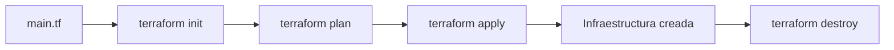

# 🏗️ Terraform para Data - Ayuda Memoria

## 1. 🧠 Conceptos Básicos



| Concepto | Descripción |
| :--- | :--- |
| **Provider** | Plugin que conecta con AWS, GCP, Azure, etc. |
| **Resource** | Componente de infraestructura a crear |
| **Module** | Grupo reutilizable de recursos |
| **State** | Archivo que rastrea el estado actual de la infra |
| **Plan** | Preview de cambios antes de aplicar |
| **Backend** | Dónde se almacena el state (S3, GCS, etc.) |

---

## 2. 🛠️ Comandos Esenciales

```bash
terraform init             # Inicializar proyecto y descargar providers
terraform plan             # Ver qué cambios se harán
terraform apply            # Aplicar cambios
terraform apply -auto-approve  # Sin confirmación
terraform destroy          # Eliminar toda la infra
terraform fmt              # Formatear código
terraform validate         # Validar sintaxis
terraform state list       # Ver recursos gestionados
terraform import aws_s3_bucket.mi_bucket mi-bucket  # Importar recurso existente
terraform output           # Ver outputs
```

---

## 3. ☁️ AWS - Recursos de Data

### S3 Bucket para Data Lake
```hcl
resource "aws_s3_bucket" "data_lake" {
  bucket = "empresa-data-lake-prod"
  tags = {
    Environment = "production"
    Team        = "data-engineering"
  }
}

resource "aws_s3_bucket_versioning" "data_lake" {
  bucket = aws_s3_bucket.data_lake.id
  versioning_configuration {
    status = "Enabled"
  }
}

resource "aws_s3_bucket_lifecycle_configuration" "data_lake" {
  bucket = aws_s3_bucket.data_lake.id
  rule {
    id     = "mover_a_glacier"
    status = "Enabled"
    transition {
      days          = 90
      storage_class = "GLACIER"
    }
    expiration {
      days = 365
    }
    filter {
      prefix = "raw/"
    }
  }
}
```

### Glue Job (ETL)
```hcl
resource "aws_glue_job" "etl_ventas" {
  name     = "etl-ventas-diario"
  role_arn = aws_iam_role.glue_role.arn
  
  command {
    name            = "glueetl"
    script_location = "s3://${aws_s3_bucket.scripts.id}/etl/ventas.py"
    python_version  = "3"
  }
  
  default_arguments = {
    "--job-language"          = "python"
    "--TempDir"               = "s3://${aws_s3_bucket.data_lake.id}/tmp/"
    "--enable-metrics"        = "true"
    "--enable-spark-ui"       = "true"
    "--additional-python-modules" = "great-expectations==0.18.0"
  }
  
  max_retries  = 2
  timeout      = 120
  worker_type  = "G.1X"
  number_of_workers = 10
}
```

### Redshift Serverless
```hcl
resource "aws_redshiftserverless_namespace" "analytics" {
  namespace_name = "analytics"
  db_name        = "warehouse"
  admin_username = "admin"
  admin_user_password = var.redshift_password
}

resource "aws_redshiftserverless_workgroup" "analytics" {
  namespace_name = aws_redshiftserverless_namespace.analytics.namespace_name
  workgroup_name = "analytics-wg"
  base_capacity  = 32  # RPUs
}
```

---

## 4. ☁️ GCP - Recursos de Data

### BigQuery Dataset y Tabla
```hcl
resource "google_bigquery_dataset" "analytics" {
  dataset_id = "analytics"
  project    = var.project_id
  location   = "US"
  
  default_table_expiration_ms = 7776000000  # 90 días
  
  labels = {
    team = "data-engineering"
  }
}

resource "google_bigquery_table" "ventas" {
  dataset_id = google_bigquery_dataset.analytics.dataset_id
  table_id   = "ventas"
  project    = var.project_id
  
  time_partitioning {
    type  = "DAY"
    field = "fecha"
  }
  
  clustering = ["region", "producto"]
  
  schema = file("schemas/ventas.json")
}
```

### Cloud Composer (Airflow Gestionado)
```hcl
resource "google_composer_environment" "airflow" {
  name    = "data-pipelines"
  region  = "us-central1"
  project = var.project_id
  
  config {
    software_config {
      image_version = "composer-2.5.0-airflow-2.6.3"
      pypi_packages = {
        "great-expectations" = ">=0.18.0"
        "slack-sdk"          = ">=3.0"
      }
    }
    
    workloads_config {
      scheduler {
        cpu    = 2
        memory_gb = 4
        count  = 1
      }
      worker {
        cpu    = 4
        memory_gb = 8
        min_count = 2
        max_count = 6
      }
    }
  }
}
```

---

## 5. 📦 Modules (Reutilización)

```hcl
# modules/data_pipeline/main.tf
variable "pipeline_name" {}
variable "schedule" {}
variable "source_bucket" {}
variable "dest_table" {}

resource "aws_glue_job" "pipeline" {
  name = var.pipeline_name
  # ... configuración
}

resource "aws_glue_trigger" "schedule" {
  name     = "${var.pipeline_name}-trigger"
  type     = "SCHEDULED"
  schedule = var.schedule
  actions {
    job_name = aws_glue_job.pipeline.name
  }
}

# Uso del módulo
module "pipeline_ventas" {
  source        = "./modules/data_pipeline"
  pipeline_name = "etl-ventas"
  schedule      = "cron(0 6 * * ? *)"
  source_bucket = "raw-data"
  dest_table    = "analytics.ventas"
}

module "pipeline_clientes" {
  source        = "./modules/data_pipeline"
  pipeline_name = "etl-clientes"
  schedule      = "cron(0 7 * * ? *)"
  source_bucket = "raw-data"
  dest_table    = "analytics.clientes"
}
```

---

## 6. 🔒 Variables y Secretos

```hcl
# variables.tf
variable "environment" {
  type    = string
  default = "dev"
}

variable "db_password" {
  type      = string
  sensitive = true  # No se muestra en logs
}

# terraform.tfvars (NO subir a git)
environment = "production"
db_password = "mi_secreto_seguro"

# Mejor: usar variables de entorno
# export TF_VAR_db_password="mi_secreto"
```

---

## 🧭 Navegación

Vuelve al [[Índice Data Engineering|Índice]]
Relacionado: [[Comandos Cloud y CLI|Cloud CLI]] | [[CI-CD para Pipelines|CI/CD]]
