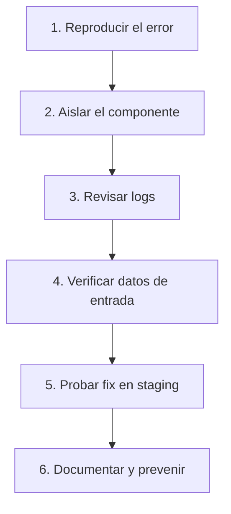

# 🔧 Troubleshooting & Debugging - Ayuda Memoria

## 1. 🔥 Errores Comunes y Soluciones

### Spark / PySpark

| Error | Causa | Solución |
| :--- | :--- | :--- |
| `OutOfMemoryError` | Datos no caben en memoria del executor | Aumentar `spark.executor.memory`, reparticionar |
| `Shuffle Spill` | Shuffle desborda a disco | Aumentar particiones, más memoria |
| `Data Skew` | Una partición tiene mucho más datos | Salting keys, `repartition()` |
| `Task not serializable` | Objeto no serializable en closure | Usar `broadcast()` o extraer a función |
| `FileNotFoundException` | Ruta incorrecta o permisos | Verificar path, IAM roles |
| `AnalysisException: cannot resolve` | Columna no existe | Verificar schema con `printSchema()` |
| `Job aborted due to stage failure` | Task falló múltiples veces | Revisar logs del executor |

### Debugging Spark
```python
# Ver plan de ejecución
df.explain(True)

# Ver schema
df.printSchema()

# Contar particiones
print(f"Particiones: {df.rdd.getNumPartitions()}")

# Verificar tamaño por partición
from pyspark.sql.functions import spark_partition_id
df.groupBy(spark_partition_id()).count().show()

# Ver logs del executor
# En Spark UI: http://driver:4040 → Stages → Task Details
```

---

### SQL

| Error | Causa | Solución |
| :--- | :--- | :--- |
| Query lenta | Falta índice o full table scan | `EXPLAIN ANALYZE`, crear índices |
| `Deadlock` | Transacciones concurrentes bloquean | Ordenar operaciones, timeout |
| `Connection refused` | BD no accesible | Verificar host, puerto, firewall |
| `Permission denied` | Sin permisos | `GRANT` apropiado |
| `Duplicate key` | Violación de constraint | `ON CONFLICT DO UPDATE` |
| `Out of disk space` | Storage lleno | `VACUUM`, limpiar logs, escalar |

### Debugging SQL
```sql
-- Plan de ejecución
EXPLAIN (ANALYZE, BUFFERS, FORMAT TEXT) 
SELECT * FROM ventas WHERE fecha > '2026-01-01';

-- Conexiones activas
SELECT * FROM pg_stat_activity WHERE state = 'active';

-- Queries lentas
SELECT pid, now() - pg_stat_activity.query_start AS duration, query
FROM pg_stat_activity
WHERE state != 'idle' AND now() - pg_stat_activity.query_start > interval '5 minutes';

-- Tamaño de tablas
SELECT schemaname, tablename, 
       pg_size_pretty(pg_total_relation_size(schemaname || '.' || tablename)) AS total
FROM pg_tables WHERE schemaname = 'public'
ORDER BY pg_total_relation_size(schemaname || '.' || tablename) DESC;

-- Locks activos
SELECT * FROM pg_locks WHERE NOT granted;
```

---

### Airflow

| Error | Causa | Solución |
| :--- | :--- | :--- |
| DAG no aparece | Error de sintaxis en DAG file | Revisar logs del scheduler |
| Task stuck en `queued` | Sin workers disponibles | Escalar workers, revisar pools |
| Task stuck en `running` | Zombie task | `airflow tasks clear`, timeout |
| `Import Error` | Dependencia faltante | Instalar en requirements |
| `XCom is too large` | Datos grandes en XCom | Usar paths de archivos, no datos |

```bash
# Debug Airflow
airflow dags list                    # Listar DAGs
airflow tasks test dag_id task_id 2026-02-12  # Ejecutar task en local
airflow dags test dag_id 2026-02-12          # Ejecutar DAG completo
airflow tasks clear dag_id -t task_id -s 2026-02-12  # Limpiar estado
```

---

### Docker / Podman

| Error | Causa | Solución |
| :--- | :--- | :--- |
| `Port already in use` | Puerto ocupado | Cambiar puerto, `lsof -i :PORT` |
| `No space left on device` | Disco lleno de imágenes/volumes | `podman system prune -a` |
| `Cannot connect to daemon` | Daemon no corriendo | `systemctl start docker` |
| `Permission denied` | Sin permisos en socket | Agregar usuario al grupo docker |

```bash
# Debug containers
podman logs -f --tail 100 mi_contenedor
podman inspect mi_contenedor
podman stats                          # Uso de recursos en vivo
podman exec -it mi_contenedor bash    # Entrar al contenedor
```

---

## 2. 🔍 Metodología de Debugging



### Preguntas Clave
1. ¿**Cuándo** empezó a fallar? (¿Qué cambió?)
2. ¿Es **intermitente** o constante?
3. ¿Afecta **todos** los datos o solo un subconjunto?
4. ¿El error es de **datos** o de **infraestructura**?
5. ¿Hay **dependencias upstream** que fallaron?

---

## 3. 📊 Comandos de Diagnóstico Rápido

```bash
# === Sistema ===
htop                         # CPU y memoria en tiempo real
iostat -x 1                  # I/O de disco
netstat -tlnp                # Puertos abiertos
ss -tlnp                     # Alternativa moderna a netstat
dmesg | tail -50             # Errores del kernel

# === Logs ===
journalctl -u servicio -f    # Logs de systemd
tail -f /var/log/syslog      # Logs del sistema
grep -r "ERROR\|FATAL" /var/log/  # Buscar errores

# === Red ===
curl -v http://api:8080/health   # Verificar conectividad
nslookup hostname                 # Resolver DNS
traceroute hostname               # Ruta de red

# === Archivos ===
wc -l archivo.csv                 # Contar líneas
head -5 archivo.csv               # Primeras 5 líneas
file archivo.dat                  # Detectar formato/encoding
iconv -f ISO-8859-1 -t UTF-8 archivo.csv > utf8.csv  # Fix encoding
```

---

## 4. 📝 Template de Postmortem

```markdown
# Postmortem: [Título del Incidente]

## Resumen
- **Fecha**: 2026-02-12
- **Duración**: 2h 30m
- **Impacto**: Dashboards de ventas sin datos por 2 horas
- **Severidad**: Alta

## Timeline
- 06:00 - Pipeline ejecutó normalmente
- 06:15 - Error en transformación por schema change en fuente
- 08:00 - Alerta detectada por equipo
- 08:30 - Fix aplicado, pipeline re-ejecutado
- 08:45 - Datos restaurados

## Causa Raíz
La API de CRM agregó una nueva columna sin aviso, rompiendo el schema esperado.

## Acciones Correctivas
- [ ] Agregar schema validation en Bronze layer
- [ ] Configurar alertas de schema change
- [ ] Documentar contrato de API con equipo CRM
```

---

## 🧭 Navegación

Vuelve al [[Índice Data Engineering|Índice]]
Relacionado: [[Observabilidad de Datos|Observabilidad]] | [[Airflow Avanzado|Airflow]] | [[Comandos Cloud y CLI|CLI]]
