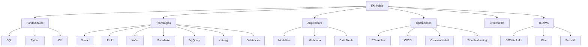

# 🗺️ Índice Data Engineering

> [!NOTE] Mapa de Contenido (MOC)
> Esta es tu guía central. Desde aquí puedes navegar a todos los temas de Data Engineering.

---

## 📚 Fundamentos

| # | Tema | Descripción |
| :--- | :--- | :--- |
| 1 | [[SQL Cheatsheet]] | JOINs, Window Functions, CTEs, optimización |
| 2 | [[Python para Data Engineering]] | Pandas, PySpark, APIs, conexiones a BD |
| 3 | [[Comandos Cloud y CLI]] | Linux, Docker/Podman, Git, AWS/GCP/Azure |

---

## 🔧 Herramientas y Tecnologías

| # | Tema | Descripción |
| :--- | :--- | :--- |
| 4 | [[Apache Spark]] | RDDs, DataFrames, optimización, Spark UI |
| 5 | [[Apache Flink]] | Streaming real-time, ventanas, PyFlink |
| 6 | [[Apache Kafka]] | Streaming de eventos, producción, consumo |
| 7 | [[Snowflake]] | Warehouses, stages, Time Travel, streams |
| 8 | [[BigQuery]] | Particiones, clustering, datos anidados |
| 9 | [[Apache Iceberg]] | Tabla abierta, schema/partition evolution |
| 10 | [[Databricks]] | Unity Catalog, Delta Lake, Auto Loader |

---

## 🏛️ Arquitectura y Diseño

| # | Tema | Descripción |
| :--- | :--- | :--- |
| 11 | [[Data Modeling]] | Star Schema, Data Vault 2.0, SCD |
| 12 | [[Arquitectura Medallion]] | Bronze, Silver, Gold en detalle |
| 13 | [[Data Mesh]] | Dominio, data products, gobernanza federada |
| 14 | [[Data Governance]] | Calidad, seguridad, linaje, compliance |

---

## ⚙️ Operaciones y Pipelines

| # | Tema | Descripción |
| :--- | :--- | :--- |
| 15 | [[ETL y Pipelines]] | Airflow básico, dbt, Docker Compose |
| 16 | [[Airflow Avanzado]] | Dynamic DAGs, Sensors, XCom, Custom Operators |
| 17 | [[Terraform para Data]] | Infraestructura como código para pipelines |
| 18 | [[CI-CD para Pipelines]] | GitHub Actions, testing, pre-commit |
| 19 | [[Observabilidad de Datos]] | Great Expectations, Soda, alertas |
| 20 | [[Troubleshooting]] | Errores comunes, debugging, postmortems |

---

## ☁️ AWS para Banca

| # | Tema | Descripción |
| :--- | :--- | :--- |
| 21 | [[Índice AWS\|🗺️ Índice AWS]] | Mapa completo de servicios AWS |
| 22 | [[AWS S3 y Data Lake]] | Buckets, Athena, Lake Formation |
| 23 | [[AWS Glue]] | Crawlers, ETL PySpark, Data Quality |
| 24 | [[AWS Redshift]] | COPY/UNLOAD, Spectrum, WLM |
| 25 | [[AWS Kinesis]] | Streams, Firehose, fraud detection |
| 26 | [[AWS Lambda y Serverless]] | Triggers, Step Functions, EventBridge |
| 27 | [[AWS IAM y Seguridad Bancaria]] | KMS, Secrets Manager, compliance |

---

## 📈 Crecimiento Profesional

| # | Tema | Descripción |
| :--- | :--- | :--- |
| 28 | [[Preguntas de Entrevista]] | SQL, system design, escenarios prácticos |
| 29 | [[Glosario de Términos]] | Diccionario completo A-Z |

---

## 🏷️ Tags
#data-engineering #sql #python #etl #cloud #kafka #snowflake #bigquery #iceberg #spark #flink #databricks #terraform #airflow #dbt #data-mesh #governance #observability #aws #banca

---

## 📖 Otras Guías en el Vault

- [[Markdown Cheatsheet|Guía Básica de Markdown]]
- [[Advanced Markdown Guide|Guía Avanzada de Markdown]]
