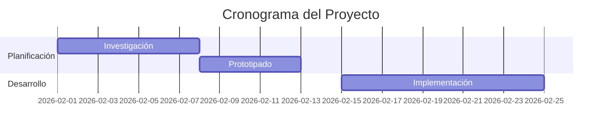
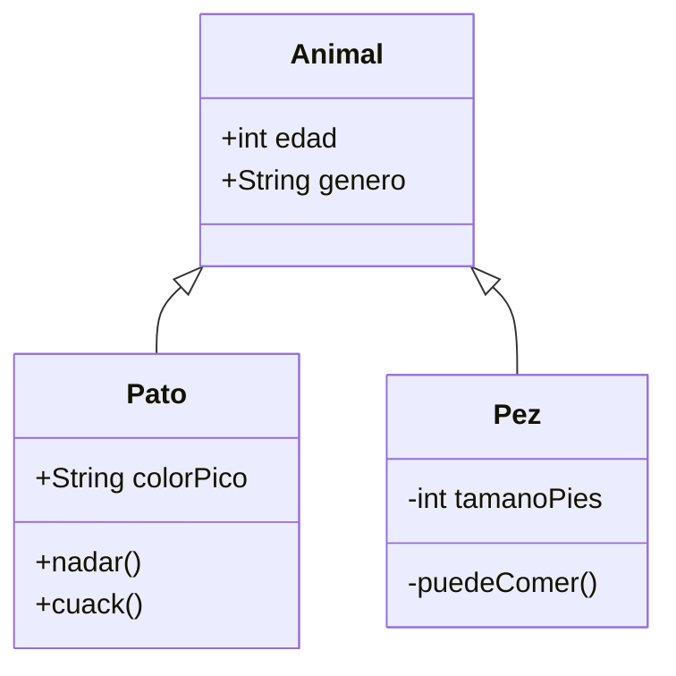
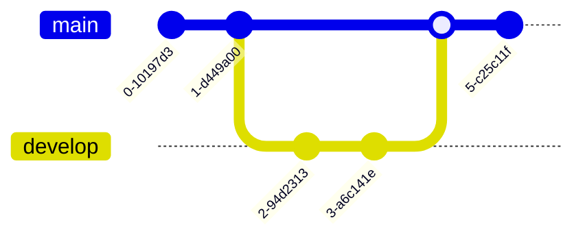

# 🚀 Guía Avanzada de Markdown y Obsidian para Usuarios Expertos

¿Listo para subir de nivel? Aquí tienes las técnicas avanzadas para hacer tus notas interactivas y profesionales.

## 1. 🎭 HTML y Estilos

Markdown es genial, pero a veces necesitas HTML para diseños específicos.

### Secciones Colapsables (Spoilers)
Ideal para ocultar registros largos o respuestas.
```html
<details>
<summary>Haz clic para expandir 🔻</summary>

¡Aquí está el contenido oculto!
- Soporta markdown
- **Texto en negrita**
</details>
```

### Centrado y Redimensionado
<center>
  <b>Este texto está centrado</b>
  <br>
  
</center>

```html
<center>Texto</center>

```

### Texto con Color (HTML)
<span style="color:red">Este texto es rojo.</span>
<span style="background-color:yellow; color:black">Estilo resaltador</span>

```html
<span style="color:red">Rojo</span>
```

---

## 2. 👣 Notas al Pie y Comentarios

### Notas al Pie
Agrega citas o información extra sin saturar el texto.
Aquí hay una afirmación[^1]. Y otra más[^2].

[^1]: Esta es la referencia de la primera nota al pie.
[^2]: También puedes escribir notas al pie en línea así ^[Nota en línea].

### Comentarios (Texto Oculto)
Texto que solo aparece en modo Edición, no en modo Lectura/Vista Previa.
`%% Este es un comentario solo para ti %%`

---

## 3. 🧠 Diagramas Avanzados (Mermaid)

### Diagrama de Gantt (Gestión de Proyectos)


### Diagrama de Clases (POO)


### Gráfico de Git


---

## 4. 🔗 Enlaces Avanzados (URI y Bloques)

### Enlace a un Encabezado específico
`[[Markdown Cheatsheet#2. Encabezados]]`

### Enlace a un Bloque específico
Escribe un párrafo estándar. ^idunico

Enlázalo así: `[[Guía Avanzada de Markdown#^idunico]]`

### URI de Obsidian (Apps Externas)
Puedes abrir esta nota desde una terminal u otra aplicación:
`obsidian://open?vault=Conocimiento&file=Obsidian%20Cheatsheets%2FGuía%20Avanzada%20de%20Markdown`

---

## 5. 🧮 Matemáticas Avanzadas (LaTeX)

### Matrices
$$
\begin{bmatrix}
1 & 2 & 3 \\
a & b & c
\end{bmatrix}
$$

### Casos
$$
f(n) = \begin{cases} 
n/2 & \text{si } n \text{ es par} \\
3n+1 & \text{si } n \text{ es impar}
\end{cases}
$$

---

## 6. ⌨️ Atajos de Teclado (Hotkeys)

| Comando | Windows/Linux | Mac |
| :--- | :--- | :--- |
| **Paleta de Comandos** | `Ctrl + P` | `Cmd + P` |
| **Cambio Rápido** | `Ctrl + O` | `Cmd + O` |
| **Crear Nota** | `Ctrl + N` | `Cmd + N` |
| **Alternar Vista/Edición** | `Ctrl + E` | `Cmd + E` |
| **Atrás/Adelante** | `Alt + ←/→` | `Cmd + ←/→` |

---

## 7. 🧪 Callouts (Más Tipos)

> [!BUG] Bug
> Reporta errores aquí.

> [!SUCCESS] Éxito
> Operación completada.

> [!QUESTION] Pregunta
> ¿Qué opinas?

> [!FAILURE] Fallo
> Algo salió mal.

> [!TODO] Por Hacer
> - [ ] Terminar esta tarea

---

## 8. 🧭 Navegación

¿Necesitas repasar lo básico? Vuelve al [[Markdown Cheatsheet|Cheatsheet Básico]].
