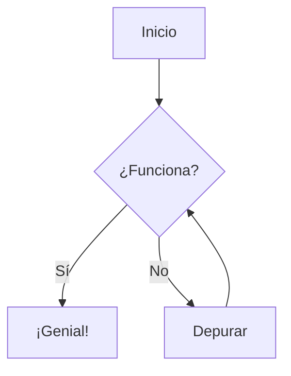
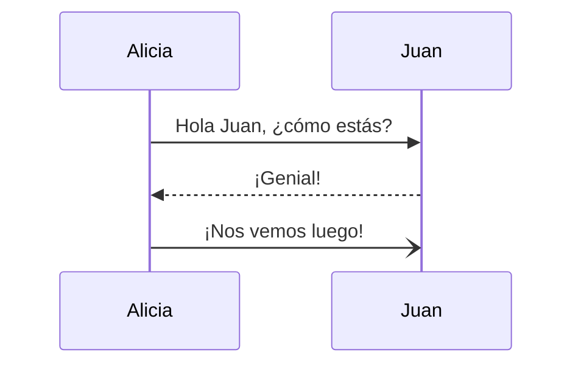
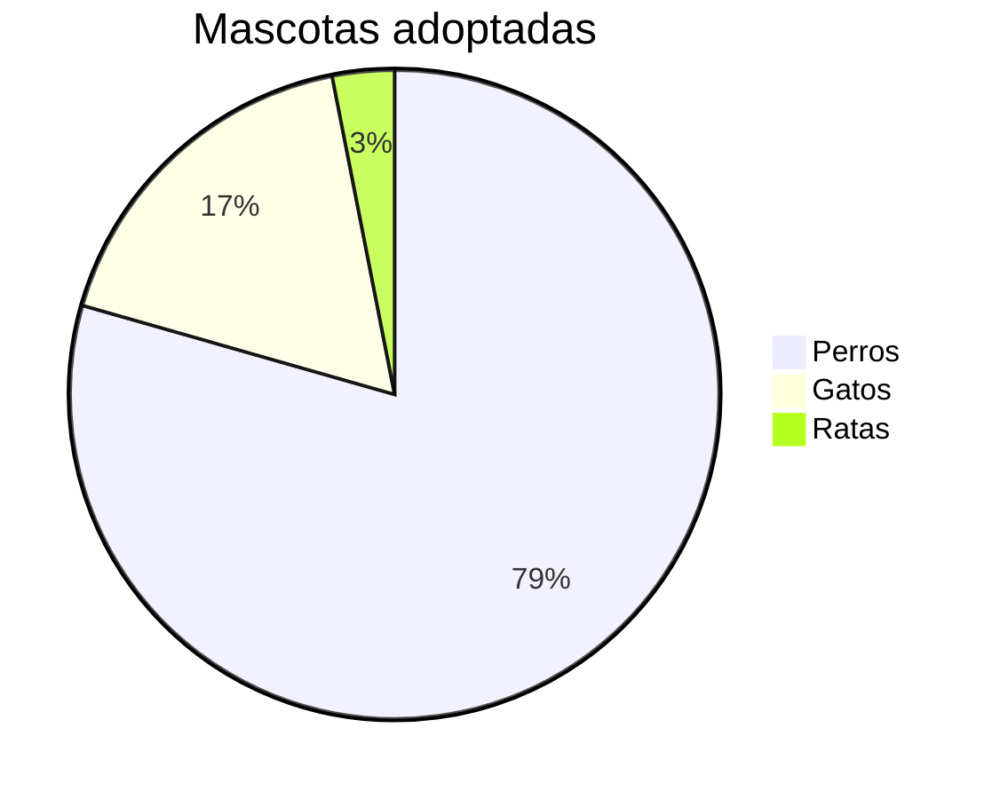

# 🧙‍♂️ Guía Suprema de Markdown y Obsidian

Bienvenido a tu guía definitiva para Markdown y Obsidian. Esta nota está diseñada para ser una referencia viva.

## 1. 📝 Formato Básico

| Estilo | Sintaxis | Ejemplo |
| :--- | :--- | :--- |
| **Negrita** | `**Negrita**` | **Negrita** |
| *Cursiva* | `*Cursiva*` | *Cursiva* |
| ***Negrita Cursiva*** | `***Negrita Cursiva***` | ***Negrita Cursiva*** |
| ~~Tachado~~ | `~~Tachado~~` | ~~Tachado~~ |
| ==Resaltado== | `==Resaltado==` | ==Resaltado== |
| `Código en línea` | `` `Código` `` | `Código` |

---

## 2. Encabezados

```markdown
# H1 (El más grande)
## H2
### H3
#### H4
##### H5
###### H6 (El más pequeño)
```

---

## 3. 🔗 Enlaces e Incrustaciones (Poderes de Obsidian)

### Enlaces Internos
Enlaza a otras notas en tu bóveda usando corchetes dobles.
- Sintaxis: `[[Nombre de la Nota]]`
- Con alias (texto personalizado): `[[Nombre de la Nota|Texto Personalizado]]`
- A un encabezado específico: `[[Nombre de la Nota#Encabezado]]`
- A un bloque específico: `[[Nombre de la Nota#^idbloque]]`

### Enlaces Externos
- `[Google](https://google.com)` -> [Google](https://google.com)
- URL simple: <https://google.com>

### Incrustaciones (Embeds)
Muestra el contenido de otra nota o imagen *dentro* de esta.
- Sintaxis: `![[Nombre de la Nota]]` (Agrega `!` antes del enlace)
- Imágenes: `![[imagen.png]]`
- Redimensionar imagen: `![[imagen.png|100]]` (cambia el ancho a 100px)

---

## 4. 📋 Listas y Tareas

### Lista Desordenada
- Elemento 1
- Elemento 2
  - Subelemento (Indenta con Tab)

### Lista Ordenada
1. Primero
2. Segundo
   1. Sub-ordenado

### Lista de Tareas (Checkboxes)
- [ ] Por hacer
- [x] Hecho (`- [x]`)
- [ ] Incompleto (`- [ ]`)

---

## 5. 🧩 Callouts (Especial de Obsidian)
Usa "callouts" para resaltar información importante.

```markdown
> [!NOTE] Título
> Contenido aquí
```

> [!NOTE] Nota
> Nota estándar.

> [!TIP] Consejo
> Consejos útiles.

> [!WARNING] Advertencia
> ¡Ten cuidado!

> [!DANGER] Peligro
> Errores críticos.

> [!EXAMPLE] Ejemplo
> Para mostrar ejemplos.

> [!QUOTE] Cita
> "La mejor forma de predecir el futuro es inventarlo."

*Otros: `INFO`, `TODO`, `BUG`, `SUCCESS`, `QUESTION`, `FAILURE`*

---

## 6. 💻 Bloques de Código

Usa tres comillas invertidas más el nombre del lenguaje para resaltado de sintaxis.

```python
def hola_mundo():
    print("¡Hola, Obsidian!")
```

```javascript
console.log("Markdown es asombroso");
```

---

## 7. 📊 Tablas

| Sintaxis | Descripción | Alineación |
| :--- | :----: | ---: |
| `Izquierda` | `Centro` | `Derecha` |
| `:-` | `:-:` | `-:` |

---

## 8. 📐 Matemáticas (LaTeX)

Matemáticas en línea: `$E = mc^2$`

Bloque matemático (`$$`):
$$
\int_0^\infty x^2 dx
$$

---

## 9. 🧜‍♀️ Diagramas Mermaid
¡Dibuja diagramas usando código!

### Diagrama de Flujo


### Diagrama de Secuencia


### Gráfico Pastel


---

## 10. 🏷️ Etiquetas y Metadatos

### Etiquetas (Tags)
Etiqueta tus notas para organizarlas.
- `#etiqueta`
- `#categoria/subcategoria` (Etiquetas anidadas)

### Frontmatter (YAML)
Agrega esto al principio de tu nota:
```yaml
---
tags: [conocimiento, guia]
alias: ["Guía de Markdown"]
date: 2026-02-12
---
```

---

## 11. 🧭 Navegación

¿Listo para más? Ve a la [[Advanced Markdown Guide|Guía Avanzada]] para convertirte en un experto.
